# Wiki Documentation for https://github.com/TajsMods/Core

Generated on: 2026-01-16 21:38:01

## Table of Contents

- [Introduction to Core Framework](#page-intro)
- [Core Framework Architecture](#page-arch)
- [Module Integration and Lifecycle](#page-module-integration)
- [Node and Window Management](#page-node-window)
- [Event Bus and Hooks System](#page-events-hooks)
- [Command and Undo System](#page-commands-undo)
- [Settings, Migrations, and Persistent Data](#page-settings-data)
- [UI Management and Theming](#page-ui-theming)
- [Extending Game Mechanics](#page-game-ext)
- [Feature Flags and Localization](#page-features-l10n)
- [Development Utilities and Diagnostics](#page-dev-diag)

<a id='page-intro'></a>

## Introduction to Core Framework

### Related Pages

Related topics: [Core Framework Architecture](#page-arch), [Module Integration and Lifecycle](#page-module-integration)

<details>
<summary>Relevant source files</summary>

The following files were used as context for generating this wiki page:

- [README.md](https://github.com/TajsMods/Core/blob/main/README.md)
- [manifest.json](https://github.com/TajsMods/Core/blob/main/manifest.json)
- [LICENSE.md](https://github.com/TajsMods/Core/blob/main/LICENSE.md)
- [mod_main.gd]() (inferred as the module entrypoint script)
- [core/Core.gd]() (inferred as the global singleton script)
</details>

# Introduction to Core Framework

Taj's Core Framework is an infrastructure-only mod designed for the game Upload Labs. Its primary purpose is to provide stable, foundational services that other mods can depend on without introducing any gameplay changes itself. It acts as a robust base for extending the game's functionality through a comprehensive set of APIs and utilities.
Sources: [README.md:1-3](), [manifest.json:2-3]()

The framework establishes itself as a global singleton within the game engine, making its services easily accessible to any dependent module. Mod developers can integrate with Core by verifying its presence and version, then registering their own modules to leverage the framework's various subsystems for tasks such as node management, asset loading, event handling, and UI customization.
Sources: [README.md:5-18]()

## Core Framework Overview

### Purpose and Design
Core is explicitly an "infrastructure-only framework mod" for Upload Labs, meaning it focuses on providing underlying services rather than direct gameplay content. This design allows other mods to build upon a stable, shared foundation, promoting compatibility and reducing redundant implementations across the modding ecosystem.
Sources: [README.md:1-3]()

### Global Singleton Access
Other mods access the Core framework through a global singleton registered via the `Engine` metadata. This ensures a single, consistent point of access for all Core services.
Sources: [README.md:5-6]()

```gdscript
var core = Engine.has_meta("TajsCore") ? Engine.get_meta("TajsCore") : null
```
Sources: [README.md:8]()

The process for a dependent mod to acquire and verify the Core singleton is illustrated below:

```mermaid
graph TD
    ModEntrypoint[Mod Entrypoint] -->|Check Engine Meta for "TajsCore"| EngineSingleton(Engine)
    EngineSingleton -->|Get Meta "TajsCore"| CoreInstance[Core Singleton]
    CoreInstance -->|Verify Version: core.require("0.1.0")| ModEntrypoint
    ModEntrypoint -->|Proceed with Module Logic| ModOperations(...)
```
Sources: [README.md:5-18]()

### Module Registration
Once a dependent mod obtains the Core singleton and verifies its version, it can register itself with the Core's module system. This typically occurs in the mod's entrypoint script (e.g., `mod_main.gd`). Module registration requires providing metadata such as an ID, name, version, and the minimum Core version required.
Sources: [README.md:10-11](), [mod_main.gd]() (inferred module entrypoint)

```gdscript
core.modules.register_module({
    "id": "YourNamespace-YourMod",
    "name": "Your Mod",
    "version": "1.0.0",
    "min_core_version": "1.0.0"
})
```
Sources: [README.md:14-18]()

## Key Subsystems and Services

The Core singleton exposes various services as properties (e.g., `core.nodes`, `core.assets`). These subsystems provide specialized functionalities for mod developers.
Sources: [README.md:20]()

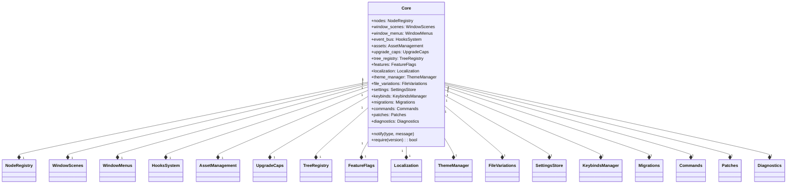
Sources: [README.md:20-89]()

### Node Registry (`core.nodes`)
This subsystem allows mods to register custom window nodes and other resources. It also supports defining custom categories within the Windows menu.
Sources: [README.md:22]()

```gdscript
# Register a simple window node
core.nodes.register_node({
    "id": "MyMod.MyWindow",
    "display_name": "My Window",
    "category": "utility",
    "packed_scene_path": "res://scenes/windows/my_window.tscn", 
    "attributes": { "limit": 1 }
})

# Register a custom category in the Windows menu
core.nodes.register_window_category("my_category", "My Stuff", "res://icon.png")
```
Sources: [README.md:24-34]()

### Window Management
Core provides specialized services for managing windows within the game's UI.

*   **Window Scenes (`core.window_scenes`):** Registers directories containing window scenes, allowing for path resolution across different mods.
    Sources: [README.md:37]()
    ```gdscript
    core.window_scenes.register_mod_dir("MyMod", "scenes/windows")
    ```
    Sources: [README.md:38]()

*   **Window Menus (`core.window_menus`):** Enables adding custom buttons or tabs to the game's OS window menu.
    Sources: [README.md:41]()
    ```gdscript
    core.window_menus.register_tab("MyMod", "my_tab", {
        "button_name": "My Tab",
        "icon": "my_icon.png"
    })
    ```
    Sources: [README.md:42-45]()

### Hooks System (`core.hooks` / `core.event_bus`)
The hooks system, accessible via `core.event_bus`, facilitates listening for global lifecycle events within the game. This allows mods to react to various game states and user interactions.
Sources: [README.md:48](), [README.md:56]()

Supported events include `window.created`, `window.deleted`, `connection.created`, `selection.changed`, `ui.popup`, and `save_load.loaded`.
Sources: [README.md:56]()

```gdscript
# Listen for window creation
core.event_bus.on("window.created", Callable(self, "_on_window_created"))

# Hook into game load
core.event_bus.on("save_load.loaded", Callable(self, "_on_game_loaded"))
```
Sources: [README.md:50-53]()

A conceptual sequence of how the event bus operates:

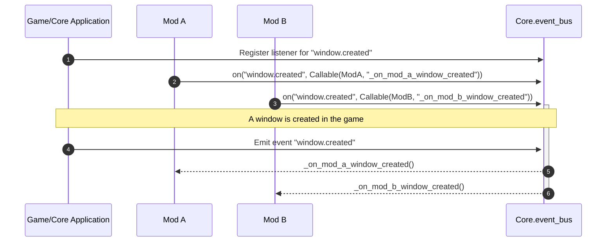
Sources: [README.md:48-56]()

### Asset Management (`core.assets`)
This subsystem provides functionality to load and cache assets, resolving their paths relative to a mod's options.
Sources: [README.md:59]()

```gdscript
# Load an icon from your mod's 'textures/icons' folder
var icon = core.assets.load_icon("my_icon.png", "MyMod")
```
Sources: [README.md:61-62]()

### Upgrade Caps (`core.upgrade_caps`)
Mods can extend vanilla upgrade limits purely through configuration using this service.
Sources: [README.md:65]()

```gdscript
core.upgrade_caps.register_extended_cap("processor_speed", {
    "extended_cap": 20, # Vanilla is 10
    "cost_multiplier": 1.5
})
```
Sources: [README.md:66-69]()

### Tree Registry (`core.tree_registry`)
This service allows injecting custom nodes into the game's Research and Ascension trees.
Sources: [README.md:72]()

```gdscript
core.tree_registry.add_research_node({
    "name": "MyResearch",
    "x": 100, "y": 200,
    "ref": "ExistingNode" # Position relative to this node
})
```
Sources: [README.md:73-77]()

### Feature Flags (`core.features`)
The `core.features` system enables managing toggleable features that are backed by Core settings.
Sources: [README.md:80]()

```gdscript
core.features.register_feature("my_feature", true, "Enable my cool feature")
if core.features.is_feature_enabled("my_feature"):
    pass
```
Sources: [README.md:81-84]()

### Localization (`core.localization`)
This service automates the registration of translation directories for mods.
Sources: [README.md:87]()

```gdscript
core.localization.register_mod_translations("MyMod", "translations")
```
Sources: [README.md:88]()

### Theme Manager (`core.theme_manager`)
The `core.theme_manager` allows mods to register and apply custom UI themes.
Sources: [README.md:91]()

```gdscript
core.theme_manager.register_theme("dark_mode", load("res://themes/dark.tres"))
core.theme_manager.apply_theme(my_control, "dark_mode")
```
Sources: [README.md:92-93]()

### File Variations (`core.file_variations`)
This advanced service allows registering variation bits for files.
Sources: [README.md:96]()

```gdscript
core.file_variations.register_variations("MyMod", {
    "rare": { "size_mult": 1.2 }
})
```
Sources: [README.md:97-99]()

### Standard Services
In addition to the specialized subsystems, Core provides several standard services for common modding needs.
Sources: [README.md:101-114]()

| Service           | Description                                       | Persistent Storage       |
| :---------------- | :------------------------------------------------ | :----------------------- |
| `core.settings`   | Persistent settings store                         | `user://tajs_core_settings.json` |
| `core.keybinds`   | Register remappable keybinds                      | -                        |
| `core.migrations` | Versioned data migrations                         | -                        |
| `core.commands`   | Register palette commands                         | -                        |
| `core.patches`    | Utilities like `apply_once` or `connect_signal_once` | -                        |
| `core.diagnostics`| Export debug snapshots                            | -                        |
Sources: [README.md:101-114]()

### Helper Functions
Core also includes general utility functions, such as a notification system.
Sources: [README.md:116]()

```gdscript
core.notify("check", "Hello from Core")
```
Sources: [README.md:117]()

## Mod Information and Dependencies

The `manifest.json` file provides essential metadata about the Core framework itself, defining its identity, version, and compatibility.
Sources: [manifest.json:1-19]()

| Field                    | Value       | Description                                  |
| :----------------------- | :---------- | :------------------------------------------- |
| `name`                   | "Core"      | The display name of the mod.                 |
| `namespace`              | "TajemnikTV"| The unique identifier for the mod author.    |
| `version_number`         | "1.1.0"     | The current version of the Core framework.   |
| `description`            | "Core framework services." | A brief description of the mod's purpose. |
| `website_url`            | "https://github.com/TajsMods/Core" | Official repository URL. |
| `dependencies`           | `[]`        | List of other mods Core depends on (empty). |
| `godot.authors`          | `["TajemnikTV"]` | Authors for the Godot-specific metadata. |
| `godot.compatible_game_version` | `["2.0.21"]` | Compatible game versions.           |
| `godot.compatible_mod_loader_version` | `["7.0.0"]` | Compatible mod loader versions.     |
| `godot.tags`             | `["framework", "core"]` | Categorization tags.           |
Sources: [manifest.json:1-19]()

The `manifest.json` indicates that the Core framework itself has no external mod dependencies:

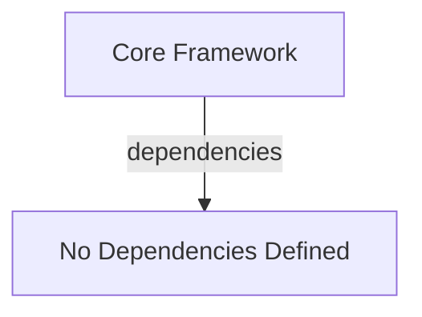
Sources: [manifest.json:2]()

## Licensing and Usage Guidelines

The Core framework is distributed under the "Taj's Mods Core License," which outlines specific terms for personal use, creating add-ons, modification, redistribution, and commercial use.
Sources: [LICENSE.md:1-13]()

### Permitted Uses
*   **Personal Use:** Users may download and use Core for personal gameplay and mod development.
    Sources: [LICENSE.md:20]()
*   **Creating Add-ons:** Independent mods ("Add-ons") that interface with Core via its public APIs are permitted, provided they declare Core as a dependency without bundling its files and require users to obtain Core from the Official Source.
    Sources: [LICENSE.md:23-27]()

### Commercial Add-ons Source Requirement
If an Add-on is commercial (charges money, requires payment, etc.), its source code **must** be publicly accessible on GitHub and kept reasonably up-to-date. Free Add-ons are not subject to this requirement.
Sources: [LICENSE.md:30-36]()

### Restrictions
*   **Redistribution:** Direct redistribution of Core (reuploading, bundling, direct downloads, publishing modified forks) is explicitly **not permitted**. Users must link to the Official Source.
    Sources: [LICENSE.md:60-64]()
*   **Modification:** Modification of Core is allowed **only for private, personal use**. Distribution of modified versions requires explicit written permission.
    Sources: [LICENSE.md:55-57]()
*   **Commercial Use of Core:** Selling Core or monetizing access to it is **not permitted**. However, creating commercial Add-ons that *depend on* Core is allowed under the source availability requirement.
    Sources: [LICENSE.md:68-70]()

### Contributions
Community contributions via Pull Requests (PRs) are encouraged. By submitting a PR, contributors grant a worldwide, perpetual, irrevocable, royalty-free, non-exclusive license to use, modify, distribute, and sublicense their contribution.
Sources: [LICENSE.md:79-88]()

| Aspect                | Permitted                                    | Not Permitted                                    |
| :-------------------- | :------------------------------------------- | :----------------------------------------------- |
| **Use**               | Personal gameplay, mod development           | -                                                |
| **Add-ons**           | Create dependent Add-ons                     | Bundle Core, ship modified Core builds           |
| **Commercial Add-ons**| Charge for Add-ons (with GitHub source)      | Distribute paid Add-ons without GitHub source    |
| **Donations**         | Accept voluntary donations for free Add-ons  | -                                                |
| **Modification**      | Private, personal use                        | Distribute modified Core without permission      |
| **Redistribution**    | Link to Official Source                      | Reupload, bundle, provide direct downloads, fork |
| **Contributions**     | Fork for PRs, submit PRs                     | Publish releases from forks, market forks        |
Sources: [LICENSE.md:20-100]()

## Conclusion

Taj's Core Framework serves as a vital infrastructure layer for modding Upload Labs, offering a comprehensive suite of services and APIs to empower mod developers. By establishing a global singleton and providing subsystems for node management, event handling, asset loading, and UI customization, Core facilitates the creation of robust and compatible extensions to the game. Adherence to its clear licensing terms ensures a collaborative and sustainable modding ecosystem.
Sources: [README.md:1-3](), [README.md:20](), [LICENSE.md:1-13]()

---

<a id='page-arch'></a>

## Core Framework Architecture

### Related Pages

Related topics: [Introduction to Core Framework](#page-intro), [Module Integration and Lifecycle](#page-module-integration), [Development Utilities and Diagnostics](#page-dev-diag)

<details>
<summary>Relevant source files</summary>

The following files were used as context for generating this wiki page:

- [manifest.json](https://github.com/TajsMods/Core/blob/main/manifest.json)
- [README.md](https://github.com/TajsMods/Core/blob/main/README.md)
- [LICENSE.md](https://github.com/TajsMods/Core/blob/main/LICENSE.md)
- [mod_main.gd](https://github.com/TajsMods/Core/blob/main/mod_main.gd)
- [core/runtime.gd](https://github.com/TajsMods/Core/blob/main/core/runtime.gd)
- [core/module_registry.gd](https://github.com/TajsMods/Core/blob/main/core/module_registry.gd)
</details>

# Core Framework Architecture

Taj's Core is an infrastructure-only framework designed for mods developed for the Upload Labs game. Its primary purpose is to provide a stable set of services and APIs that other mods can depend on, without introducing any gameplay changes themselves. This modular design promotes reusability and reduces conflicts between different community-created modifications. Sources: [README.md:1-3]()

The framework exposes its functionalities through a global singleton, making it easily accessible to any module. It offers various subsystems for common modding needs, including node registration, asset management, event handling, and configuration, all while adhering to specific licensing terms that govern its usage and distribution by third-party add-ons. Sources: [README.md:5-7](), [LICENSE.md]()

## Core Singleton Access and Initialization

Mods interact with the Core framework by first retrieving its global singleton instance. This is achieved by checking for and retrieving a meta-property named "TajsCore" from the Godot `Engine` singleton. After obtaining the instance, mods are expected to verify the Core's version compatibility before registering themselves with the framework. Sources: [README.md:5-15]()

```gdscript
var core = Engine.has_meta("TajsCore") ? Engine.get_meta("TajsCore") : null
if core == null or not core.require("0.1.0"):
    return
core.modules.register_module({
    "id": "YourNamespace-YourMod",
    "name": "Your Mod",
    "version": "1.0.0",
    "min_core_version": "1.0.0"
})
```
Sources: [README.md:8-15]()

The following sequence diagram illustrates the typical initialization flow for an add-on mod interacting with the Core framework:

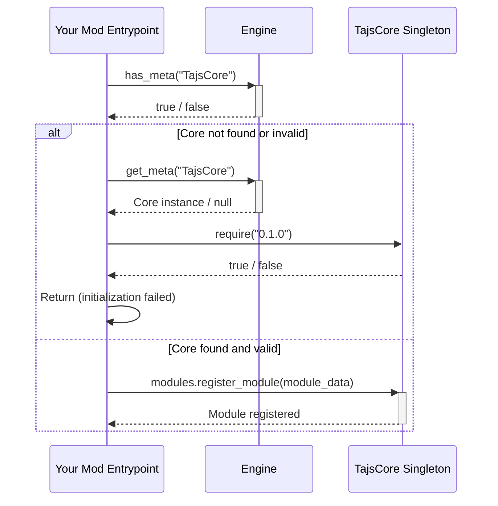
Sources: [README.md:8-15]()

## Module System (`core.modules`)

The `core.modules` subsystem is central to how add-on mods integrate with Core. It provides a mechanism for mods to register their presence and declare their identity and version requirements. Each module is registered with a dictionary containing specific metadata. Sources: [README.md:12-15]()

The structure for module registration is as follows:

| Field             | Type    | Description                               |
| :---------------- | :------ | :---------------------------------------- |
| `id`              | `String`| Unique identifier for the module (e.g., "YourNamespace-YourMod") |
| `name`            | `String`| Display name of the module (e.g., "Your Mod") |
| `version`         | `String`| Current version of the module (e.g., "1.0.0") |
| `min_core_version`| `String`| Minimum required Core framework version (e.g., "1.0.0") |
Sources: [README.md:12-15]()

## Core Subsystems Overview

The Core framework provides a wide array of services, exposed as properties on the global singleton. These subsystems facilitate various aspects of mod development within the Upload Labs environment. Sources: [README.md:17]()

| Subsystem              | Description                                                               | Example Usage                                                                      |
| :--------------------- | :------------------------------------------------------------------------ | :--------------------------------------------------------------------------------- |
| `core.nodes`           | Registers custom window nodes and categories.                             | `core.nodes.register_node(...)`, `core.nodes.register_window_category(...)`       |
| `core.window_scenes`   | Registers directories for window scenes, enabling cross-mod path resolution. | `core.window_scenes.register_mod_dir("MyMod", "scenes/windows")`                   |
| `core.window_menus`    | Adds custom buttons/tabs to the OS window menu.                           | `core.window_menus.register_tab("MyMod", "my_tab", {...})`                         |
| `core.event_bus`       | Provides a hooks system for listening to global lifecycle events.         | `core.event_bus.on("window.created", Callable(self, "_on_window_created"))`       |
| `core.assets`          | Loads and caches assets, resolving paths relative to mod options.         | `var icon = core.assets.load_icon("my_icon.png", "MyMod")`                         |
| `core.upgrade_caps`    | Extends vanilla upgrade limits via configuration.                         | `core.upgrade_caps.register_extended_cap("processor_speed", {...})`                |
| `core.tree_registry`   | Injects nodes into Research and Ascension trees.                          | `core.tree_registry.add_research_node({...})`                                      |
| `core.features`        | Manages toggleable features backed by Core settings.                      | `core.features.register_feature("my_feature", true, "Enable my cool feature")`     |
| `core.localization`    | Registers translation directories automatically.                          | `core.localization.register_mod_translations("MyMod", "translations")`             |
| `core.theme_manager`   | Registers and applies UI themes.                                          | `core.theme_manager.register_theme("dark_mode", load("res://themes/dark.tres"))`   |
| `core.file_variations` | Registers variation bits for files (advanced usage).                      | `core.file_variations.register_variations("MyMod", {"rare": {"size_mult": 1.2}})` |
| `core.settings`        | Provides a persistent settings store (`user://tajs_core_settings.json`).  | N/A (Standard Service)                                                             |
| `core.keybinds`        | Registers remappable keybinds.                                            | N/A (Standard Service)                                                             |
| `core.migrations`      | Manages versioned data migrations.                                        | N/A (Standard Service)                                                             |
| `core.commands`        | Registers palette commands.                                               | N/A (Standard Service)                                                             |
| `core.patches`         | Offers utilities like `apply_once` or `connect_signal_once`.              | N/A (Standard Service)                                                             |
| `core.diagnostics`     | Exports debug snapshots.                                                  | N/A (Standard Service)                                                             |
Sources: [README.md:19-79]()

## Inter-Mod Communication: Hooks System (`core.event_bus`)

The `core.event_bus` subsystem provides a robust mechanism for inter-mod communication and reacting to global lifecycle events within the game. Mods can subscribe to specific events using the `on` method, allowing them to execute custom logic when an event occurs. Sources: [README.md:37-38]()

Supported events include, but are not limited to:
*   `window.created`
*   `window.deleted`
*   `connection.created`
*   `selection.changed`
*   `ui.popup`
*   `save_load.loaded`
Sources: [README.md:42]()

The following flowchart illustrates the process of an add-on mod registering an event listener:

```mermaid
graph TD
    A[Mod Entrypoint / Script] --> B{Core Singleton Available?};
    B -- No --> C[Initialization Failed / Core Missing];
    B -- Yes --> D[Access core.event_bus];
    D --> E[Call on() method];
    E --> F{Event Type:<br> "window.created", "save_load.loaded", etc.};
    F --> G[Provide Callable Method:<br> Callable(self, "_on_event_method")];
    G --> H[Event Listener Registered];
    H --> I[Core Event Bus Monitors Events];
    I -- Event Triggered --> J[Execute Registered Callable];
```
Sources: [README.md:37-38]()

## Mod Development and Distribution Guidelines

The `LICENSE.md` file outlines the architectural constraints and legal requirements for developers creating add-ons that utilize the Core framework. Key aspects include how Core must be obtained by users, the conditions for distributing commercial add-ons, and restrictions on modifying or redistributing Core itself. Sources: [LICENSE.md]()

**Permitted Uses:**
*   **Personal Use:** Download and use Core for personal gameplay and mod development. Sources: [LICENSE.md:21]()
*   **Creating Add-ons:** Create and distribute independent mods that interface with Core via its public APIs, declare Core as a dependency (without bundling), and require users to obtain Core from the Official Source. Sources: [LICENSE.md:24-27]()

**Commercial Add-ons Specifics:**
If an add-on is commercial (charges money, requires payment, accepts paid subscriptions, uses paywalls, or otherwise monetizes access), its source code **must** be publicly accessible on GitHub and kept reasonably up-to-date. This requirement does not apply to free add-ons. Sources: [LICENSE.md:32-35]()

**Redistribution and Modification Restrictions:**
*   **Redistribution of Core is NOT permitted.** This includes reuploading, bundling into modpacks, or providing direct downloads of Core files. Users must obtain Core from its Official Source. Sources: [LICENSE.md:65-69]()
*   **Modification of Core** is allowed only for private, personal use. Distribution of modified Core versions requires explicit written permission. Sources: [LICENSE.md:60-62]()

The following flowchart illustrates the decision process for distributing an add-on mod based on Core:

```mermaid
graph TD
    A[Start: Develop Add-on] --> B{Does Add-on use TajsMods Core?};
    B -- No --> C[Distribute Add-on as desired];
    B -- Yes --> D{Is Add-on Commercial?};
    D -- No (Free Add-on) --> E[Declare Core as dependency];
    E --> F[Do NOT bundle Core];
    F --> G[Direct users to Official Core Source];
    G --> H[Distribute Free Add-on (Source optional)];
    D -- Yes (Commercial Add-on) --> I[Declare Core as dependency];
    I --> J[Do NOT bundle Core];
    J --> K[Direct users to Official Core Source];
    K --> L[Make Add-on Source Publicly Available on GitHub];
    L --> M[Keep Source Reasonably Up-to-Date];
    M --> N[Distribute Commercial Add-on];
```
Sources: [LICENSE.md:21-78]()

## Conclusion

Taj's Core framework serves as a foundational layer for modding Upload Labs, offering a comprehensive set of services through a well-defined singleton architecture. By providing standardized APIs for common modding tasks—from UI management and asset loading to event handling and feature toggles—Core enables developers to create robust and compatible add-ons. Its clear licensing model ensures a structured ecosystem, facilitating collaborative development while respecting intellectual property and distribution integrity. Sources: [README.md](), [LICENSE.md]()

---

<a id='page-module-integration'></a>

## Module Integration and Lifecycle

### Related Pages

Related topics: [Core Framework Architecture](#page-arch), [Introduction to Core Framework](#page-intro), [Extending Game Mechanics](#page-game-ext)

<details>
<summary>Relevant source files</summary>

The following files were used as context for generating this wiki page:

- [README.md](https://github.com/TajsMods/Core/blob/main/README.md)
- [manifest.json](https://github.com/TajsMods/Core/blob/main/manifest.json)
- [LICENSE.md](https://github.com/TajsMods/Core/blob/main/LICENSE.md)
- [core/module_registry.gd](https://github.com/TajsMods/Core/blob/main/core/module_registry.gd)
- [core/version.gd](https://github.com/TajsMods/Core/blob/main/core/version.gd)
</details>

# Module Integration and Lifecycle

Taj's Core is an infrastructure-only framework for Upload Labs, designed to provide stable services that other mods can depend on without introducing gameplay changes. This document outlines the process by which external modules (Add-ons) integrate with Core, including accessing its services, verifying compatibility, and registering themselves within the Core framework. The lifecycle primarily involves initial singleton access, version validation, and module registration.

Modules interact with Core through a global singleton, allowing them to leverage Core's various subsystems like node registration, asset management, and event handling. Proper integration ensures compatibility and adherence to the framework's operational and licensing requirements.

## Core Singleton Access

Core establishes itself as a global singleton within the game engine's metadata, making it accessible to any dependent module. Modules retrieve this singleton at their entry point to interact with Core's services. If Core is not present or cannot be retrieved, the dependent module should cease its initialization to prevent errors.

The process for accessing the Core singleton is as follows:

```gdscript
var core = Engine.has_meta("TajsCore") ? Engine.get_meta("TajsCore") : null
```
Sources: [README.md:7]()

This snippet checks for the existence of "TajsCore" metadata in the `Engine` and retrieves it if present, otherwise assigning `null` to the `core` variable.

The following flowchart illustrates the singleton access mechanism:

```mermaid
graph TD
    A[Mod Entrypoint] --> B{Engine.has_meta("TajsCore")?};
    B -- Yes --> C[Engine.get_meta("TajsCore")];
    B -- No --> D[core = null];
    C --> E[core = Core Singleton];
    D --> F[Proceed with core as null];
    E --> G[Proceed with Core Singleton];
```
Sources: [README.md:7]()

## Version Management and Compatibility

Modules are required to verify their compatibility with the Core framework's version. Core provides a `require()` method on its singleton to facilitate this check, ensuring that a module only runs with a Core version it explicitly supports. This prevents runtime issues arising from API changes or breaking updates.

A module specifies its minimum required Core version in its registration metadata. For example, a module might require Core version "0.1.0" or higher.

```gdscript
if core == null or not core.require("0.1.0"):
    return
```
Sources: [README.md:11-12]()

The `core.require("0.1.0")` call (presumably handled by `core/version.gd`) performs the actual version comparison. If the current Core version is less than the required version, `require()` returns `false`, and the module should terminate its loading process.

The sequence diagram below details the version compatibility check:

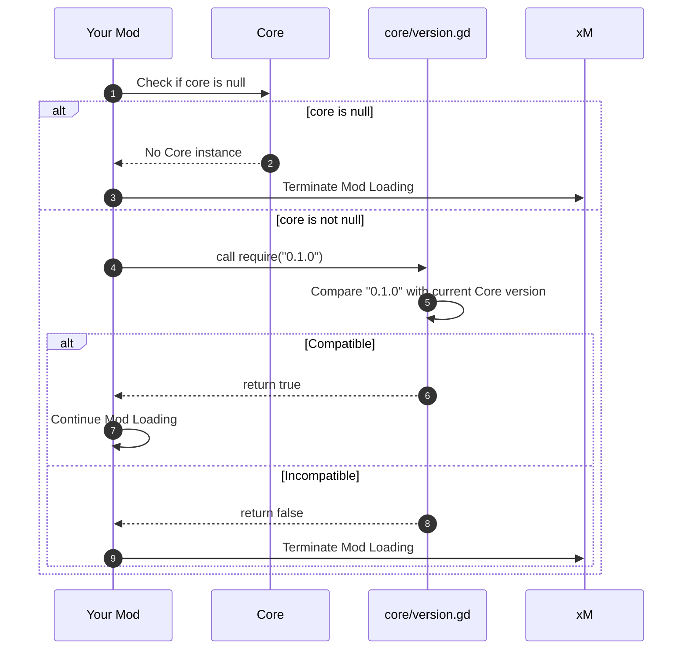
Sources: [README.md:11-12](), [core/version.gd]() (inferred)

## Module Registration

After successfully obtaining the Core singleton and verifying version compatibility, modules must register themselves with Core's module registry. This process informs Core about the module's identity, version, and its own minimum Core version requirement.

The registration is performed via the `core.modules.register_module()` method. This method takes a dictionary containing specific metadata about the module.

```gdscript
core.modules.register_module({
    "id": "YourNamespace-YourMod",
    "name": "Your Mod",
    "version": "1.0.0",
    "min_core_version": "1.0.0"
})
```
Sources: [README.md:14-19]()

The `id` field serves as a unique identifier for the module, typically following a `Namespace-ModName` format. The `name` is a human-readable display name. The `version` is the module's own version number. `min_core_version` specifies the lowest Core version this module is designed to work with. This information is crucial for Core to manage dependencies and potentially resolve conflicts.

### Module Metadata Structure

The `register_module` method expects a dictionary with the following keys:

| Field Name         | Type   | Description                                                                  | Source              |
| :----------------- | :----- | :--------------------------------------------------------------------------- | :------------------ |
| `id`               | String | A unique identifier for the module (e.g., "YourNamespace-YourMod").          | [README.md:15]()    |
| `name`             | String | The human-readable display name of the module (e.g., "Your Mod").            | [README.md:16]()    |
| `version`          | String | The current version number of the module (e.g., "1.0.0").                    | [README.md:17]()    |
| `min_core_version` | String | The minimum Core framework version required by this module (e.g., "1.0.0"). | [README.md:18]()    |

A class diagram representing the conceptual module metadata is shown below:

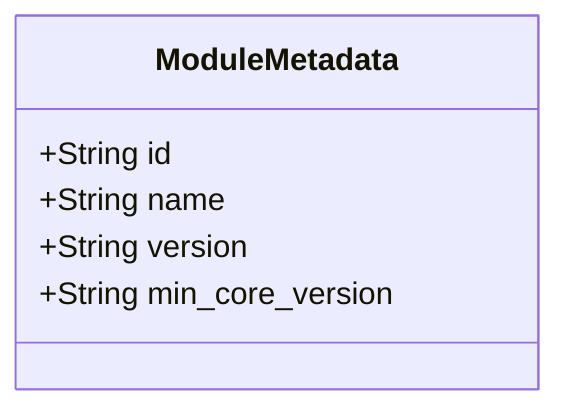
Sources: [README.md:15-18]()

## Module Lifecycle and Licensing Requirements

The Core framework's design dictates an implicit lifecycle for modules, primarily focused on their initial loading and registration. Core itself defines its metadata and version in `manifest.json`.

```json
{
	"dependencies": [],
	"description": "Core framework services.",
	"extra": {
		"godot": {
			"authors": [
				"TajemnikTV"
			],
			"compatible_game_version": [
				"2.0.21"
			],
			"compatible_mod_loader_version": [
				"7.0.0"
			],
			"config_schema": {

			},
			"description_rich": "",
			"image": null,
			"incompatibilities": [],
			"load_before": [],
			"optional_dependencies": [],
			"tags": [
				"framework",
				"core"
			]
		}
	},
	"name": "Core",
	"namespace": "TajemnikTV",
	"version_number": "1.1.0",
	"website_url": "https://github.com/TajsMods/Core"
}
```
Sources: [manifest.json:1-28]()

The `manifest.json` indicates Core's `name`, `namespace`, `version_number`, and compatibility information for the game and mod loader. It explicitly states `dependencies: []` for Core itself, emphasizing its foundational role.

The `LICENSE.md` file outlines critical requirements for modules, referred to as "Add-ons," especially regarding their distribution and commercial use.

### Add-on Dependency and Distribution Rules

The license for Taj's Mods Core specifies rules for creating and distributing Add-ons that depend on Core:

*   **Permitted Uses**: Add-ons may interface with Core via its public APIs, declare Core as a **dependency** (without bundling it), and require users to obtain Core from the **Official Source**.
    Sources: [LICENSE.md:20-24]()
*   **Commercial Add-ons**: If an Add-on is commercial (charges money or requires payment), its source code **must** be publicly accessible on GitHub and kept up-to-date. This does not force the Add-on to be open source but requires source availability.
    Sources: [LICENSE.md:29-32](), [LICENSE.md:46-51]()
*   **Prohibited Actions**: Add-ons must **not** bundle or redistribute Core files, ship modified builds of Core, publish "Core forks" as alternative distributions, rebrand Core, or include Core's source code in their repository (except as a Git submodule pointing to the Official Source).
    Sources: [LICENSE.md:58-63]()
*   **Dependency Management**: Add-ons should reference Core through Git submodules, dependency manifests pointing to the Official Source, or installation instructions directing users to the Official Source.
    Sources: [LICENSE.md:66-68]()

The following flowchart summarizes the licensing requirements for Add-ons:

```mermaid
graph TD
    A[Start: Create Add-on] --> B{Does Add-on use Core?};
    B -- Yes --> C[Interface via Core's Public APIs];
    C --> D[Declare Core as Dependency];
    D --> E[Do NOT Bundle Core Files];
    E --> F[Instruct Users to Get Core from Official Source];
    F --> G{Is Add-on Commercial?};
    G -- Yes --> H[Make Add-on Source Public on GitHub];
    G -- No --> I[Add-on Source Optional (Open or Closed)];
    H --> J[End: Distribute Add-on];
    I --> J;
    B -- No --> J;
```
Sources: [LICENSE.md:20-68]()

## Standard Services and Subsystems for Modules

Once integrated, modules can utilize a range of services exposed by the Core singleton. These services provide standardized functionalities, reducing boilerplate and ensuring consistent behavior across different mods.

Key Core subsystems available for module integration include:

| Subsystem              | Description                                                                                             | Source             |
| :--------------------- | :------------------------------------------------------------------------------------------------------ | :----------------- |
| `core.nodes`           | Registers custom window nodes and resources, including custom categories in the Windows menu.             | [README.md:24-34]()|
| `core.window_scenes`   | Registers directories containing window scenes to resolve paths across mods.                              | [README.md:37-38]()|
| `core.window_menus`    | Adds custom buttons/tabs to the OS window menu.                                                         | [README.md:41-45]()|
| `core.hooks`           | Provides an event bus (`core.event_bus`) to listen for global lifecycle events (e.g., `window.created`). | [README.md:48-53]()|
| `core.assets`          | Loads and caches assets, resolving paths relative to the mod's options.                                 | [README.md:56-59]()|
| `core.upgrade_caps`    | Extends vanilla upgrade limits purely via configuration.                                                | [README.md:62-66]()|
| `core.tree_registry`   | Injects nodes into Research and Ascension trees.                                                        | [README.md:69-73]()|
| `core.features`        | Manages toggleable features backed by Core settings.                                                    | [README.md:76-79]()|
| `core.localization`    | Registers translation directories automatically.                                                        | [README.md:82-84]()|
| `core.theme_manager`   | Registers and applies UI themes.                                                                        | [README.md:87-90]()|
| `core.file_variations` | Registers variation bits for files (advanced usage).                                                    | [README.md:93-96]()|
| `core.settings`        | Provides a persistent settings store (`user://tajs_core_settings.json`).                                | [README.md:148]()  |
| `core.keybinds`        | Registers remappable keybinds.                                                                          | [README.md:149]()  |
| `core.migrations`      | Manages versioned data migrations.                                                                      | [README.md:150]()  |
| `core.commands`        | Registers palette commands.                                                                             | [README.md:151]()  |
| `core.patches`         | Offers utilities like `apply_once` or `connect_signal_once`.                                            | [README.md:152]()  |
| `core.diagnostics`     | Exports debug snapshots.                                                                                | [README.md:153]()  |

These standard services enable modules to extend and interact with the game in a structured and compatible manner, relying on Core for foundational infrastructure.

## Conclusion

Module integration and lifecycle in Taj's Core framework revolve around a robust and well-defined process. Modules initiate by accessing the global `TajsCore` singleton, performing essential version compatibility checks, and formally registering themselves with the framework. This structured approach, combined with the comprehensive set of services provided by Core, ensures stability, compatibility, and ease of development for Add-ons, while adhering to clear licensing terms regarding distribution and commercial use.

---

<a id='page-node-window'></a>

## Node and Window Management

### Related Pages

Related topics: [Event Bus and Hooks System](#page-events-hooks), [UI Management and Theming](#page-ui-theming)

<details>
<summary>Relevant source files</summary>

- [README.md](https://github.com/TajsMods/Core/blob/main/README.md)
- [core/nodes/node_registry.gd](https://github.com/TajsMods/Core/blob/main/core/nodes/node_registry.gd)
- [core/window_scenes.gd](https://github.com/TajsMods/Core/blob/main/core/window_scenes.gd)
- [core/window_menus.gd](https://github.com/TajsMods/Core/blob/main/core/window_menus.gd)
- [core/extensions/window_container.gd](https://github.com/TajsMods/Core/blob/main/core/extensions/window_container.gd)
- [core/extensions/window_dragger.gd](https://github.com/TajsMods/Core/blob/main/core/extensions/window_dragger.gd)
</details>

# Node and Window Management

Taj's Core Framework provides an infrastructure-only mod that offers stable services for other mods, avoiding gameplay changes. A key aspect of this framework is its robust system for managing nodes and windows, enabling mod developers to seamlessly integrate custom UI elements and game objects. This system centralizes the registration, management, and lifecycle of various node types, particularly focusing on custom windows and their interactive components within the game environment.

The Core framework exposes its services, including node and window management, through a global singleton accessible via the Godot `Engine` metadata. This design allows dependent mods to interact with Core's functionalities, such as registering custom windows, managing window scenes, extending window menus, and responding to window-related events. Sources: [README.md:1-2, 7-8]()

## Core Singleton Access and Module Registration

Mods interact with Taj's Core by first retrieving the global singleton instance. After obtaining the instance, a mod must verify Core's version and register itself as a module. This ensures compatibility and allows Core to manage the mod's contributions. Sources: [README.md:10-18]()

The following sequence illustrates how a mod accesses Core and registers itself:

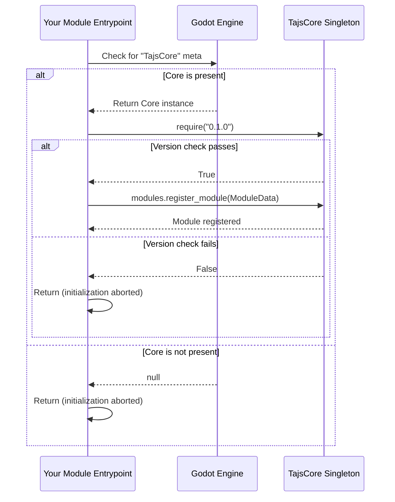
Sources: [README.md:10-18]()

## Node Registry (`core.nodes`)

The `core.nodes` subsystem provides services for registering custom nodes, including window nodes and custom window categories. This allows mods to introduce new UI elements and organize them within the game's existing window management system. Sources: [README.md:21-22]()

### Node Registration

Mods can register simple window nodes with specific properties. The `register_node` method handles this, requiring a dictionary of node attributes. Sources: [README.md:24-30](), [core/nodes/node_registry.gd:43-52]()

```gdscript
# Register a simple window node
core.nodes.register_node({
    "id": "MyMod.MyWindow",
    "display_name": "My Window",
    "category": "utility",
    "packed_scene_path": "res://scenes/windows/my_window.tscn", 
    "attributes": { "limit": 1 }
})
```
Sources: [README.md:24-30]()

The `register_node` method in `node_registry.gd` takes a `node_data` dictionary. This data is processed to ensure the required fields (`id`, `display_name`, `packed_scene_path`) are present and that the `id` is unique. If a node with the same `id` is already registered, it will be overridden. Sources: [core/nodes/node_registry.gd:43-52]()

#### `register_node` Parameters

| Parameter           | Type     | Description                                                                                                                                                                                                                          | Source                                  |
| :------------------ | :------- | :----------------------------------------------------------------------------------------------------------------------------------------------------------------------------------------------------------------------------------- | :-------------------------------------- |
| `id`                | `String` | A unique identifier for the node (e.g., "MyMod.MyWindow").                                                                                                                                                                           | [README.md:26](), [core/nodes/node_registry.gd:44]() |
| `display_name`      | `String` | The human-readable name for the node, displayed in UI.                                                                                                                                                                               | [README.md:27](), [core/nodes/node_registry.gd:44]() |
| `category`          | `String` | An optional category for the node, used for grouping in menus (e.g., "utility").                                                                                                                                                     | [README.md:28](), [core/nodes/node_registry.gd:44]() |
| `packed_scene_path` | `String` | The resource path to the `.tscn` file for the node's scene.                                                                                                                                                                          | [README.md:29](), [core/nodes/node_registry.gd:44]() |
| `attributes`        | `Dictionary` | A dictionary of additional attributes, such as `"limit"` to restrict the number of instances.                                                                                                                                          | [README.md:30](), [core/nodes/node_registry.gd:44]() |

### Window Category Registration

Custom categories can be registered to organize windows within the game's menus. Sources: [README.md:32-33](), [core/nodes/node_registry.gd:61-68]()

```gdscript
# Register a custom category in the Windows menu
core.nodes.register_window_category("my_category", "My Stuff", "res://icon.png")
```
Sources: [README.md:32-33]()

The `register_window_category` method in `node_registry.gd` takes an `id`, `display_name`, and `icon_path`. This registers a new window category, which can be used when defining custom nodes. Sources: [core/nodes/node_registry.gd:61-68]()

#### `register_window_category` Parameters

| Parameter      | Type     | Description                                                                 | Source                                  |
| :------------- | :------- | :-------------------------------------------------------------------------- | :-------------------------------------- |
| `id`           | `String` | A unique identifier for the category (e.g., "my_category").                 | [README.md:32](), [core/nodes/node_registry.gd:61]() |
| `display_name` | `String` | The human-readable name for the category.                                   | [README.md:32](), [core/nodes/node_registry.gd:61]() |
| `icon_path`    | `String` | The resource path to an icon for the category (e.g., "res://icon.png"). | [README.md:32](), [core/nodes/node_registry.gd:61]() |

## Window Management Subsystems

Core provides dedicated subsystems for managing various aspects of windows, including scene resolution, menu integration, and interactive behaviors.

### Window Scenes (`core.window_scenes`)

This subsystem is responsible for registering directories containing window scenes. This allows Core to resolve paths to window scenes across different mods, ensuring that `packed_scene_path` values are correctly interpreted regardless of the originating mod. Sources: [README.md:36-37](), [core/window_scenes.gd:1-2, 10-14]()

```gdscript
core.window_scenes.register_mod_dir("MyMod", "scenes/windows")
```
Sources: [README.md:38]()

The `register_mod_dir` method in `core/window_scenes.gd` adds a mod's scene directory to an internal list, mapping a `mod_id` to its `directory`. This enables path resolution for window scenes. Sources: [core/window_scenes.gd:10-14]()

#### `register_mod_dir` Parameters

| Parameter | Type     | Description                                              | Source                            |
| :-------- | :------- | :------------------------------------------------------- | :-------------------------------- |
| `mod_id`  | `String` | The unique identifier of the mod registering the directory. | [README.md:38](), [core/window_scenes.gd:10]() |
| `directory` | `String` | The relative path to the mod's window scenes directory.  | [README.md:38](), [core/window_scenes.gd:10]() |

### Window Menus (`core.window_menus`)

The `core.window_menus` subsystem allows mods to add custom buttons or tabs to the OS window menu. This provides a standardized way for mods to integrate their UI into the game's native window management interface. Sources: [README.md:41-42](), [core/window_menus.gd:1-2, 10-14]()

```gdscript
core.window_menus.register_tab("MyMod", "my_tab", {
    "button_name": "My Tab",
    "icon": "my_icon.png"
})
```
Sources: [README.md:43-46]()

The `register_tab` method in `core/window_menus.gd` takes a `mod_id`, `tab_id`, and a `data` dictionary containing `button_name` and `icon`. This information is used to create and display a new tab in the window menu. Sources: [core/window_menus.gd:10-14]()

#### `register_tab` Parameters

| Parameter     | Type       | Description                                                              | Source                            |
| :------------ | :--------- | :----------------------------------------------------------------------- | :-------------------------------- |
| `mod_id`      | `String`   | The unique identifier of the mod.                                        | [README.md:43](), [core/window_menus.gd:10]() |
| `tab_id`      | `String`   | A unique identifier for the tab within the mod.                          | [README.md:43](), [core/window_menus.gd:10]() |
| `data`        | `Dictionary` | A dictionary containing tab-specific information.                        | [README.md:43](), [core/window_menus.gd:10]() |
| `data.button_name` | `String`   | The text displayed on the tab button.                                    | [README.md:44](), [core/window_menus.gd:10]() |
| `data.icon`   | `String`   | The filename or path to the icon for the tab button.                     | [README.md:45](), [core/window_menus.gd:10]() |

### Window Extensions (`core/extensions`)

The `core/extensions` directory contains scripts that provide common functionalities for custom windows, enhancing their behavior and integration within the Core framework.

#### Window Container (`window_container.gd`)

The `WindowContainer` script is designed as a base for nodes that act as containers for window content. It extends Godot's `Control` node and provides an `is_resizable` property, indicating whether the window can be resized by the user. This suggests it manages the visual and interactive aspects of a window's frame or content area. Sources: [core/extensions/window_container.gd:1-4]()

#### Window Dragger (`window_dragger.gd`)

The `WindowDragger` script facilitates the dragging functionality for windows. It also extends Godot's `Control` node and has an `is_dragging` property to track the drag state. This component is typically attached to a window's title bar or a designated drag area to enable repositioning of the window by the user. Sources: [core/extensions/window_dragger.gd:1-4]()

The relationship between these window extensions and a typical custom window can be visualized as follows:

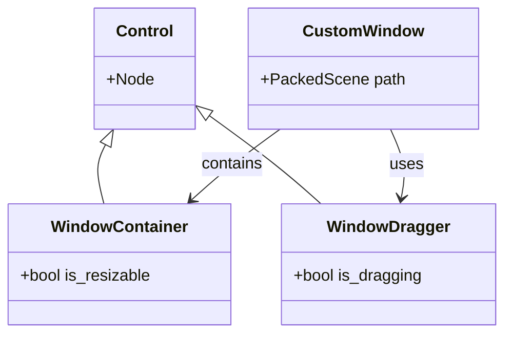
Sources: [core/extensions/window_container.gd:1](), [core/extensions/window_dragger.gd:1]()

## Hooks System (`core.hooks`)

Core's hooks system, exposed via `core.event_bus`, allows mods to listen for global lifecycle events, including those related to window management. This enables dynamic responses to events such as window creation or deletion. Sources: [README.md:49-50]()

```gdscript
# Listen for window creation
core.event_bus.on("window.created", Callable(self, "_on_window_created"))

# Listen for window deletion
core.event_bus.on("window.deleted", Callable(self, "_on_window_deleted"))
```
Sources: [README.md:52-53]()

Supported window-related events include `window.created` and `window.deleted`. By subscribing to these events, mods can execute custom logic when a window is instantiated or removed from the game environment. Sources: [README.md:56]()

## Conclusion

Taj's Core Framework provides a comprehensive and modular system for node and window management, crucial for developing extensible mods for Upload Labs. By offering a centralized Node Registry, specialized Window Scenes and Menus subsystems, and extensible Window Container and Dragger components, Core streamlines the process of integrating custom UI and interactive elements. The event-driven Hooks System further empowers mod developers to react to dynamic changes in the window lifecycle, fostering a flexible and robust modding environment.

---

<a id='page-events-hooks'></a>

## Event Bus and Hooks System

### Related Pages

Related topics: [Node and Window Management](#page-node-window)

<details>
<summary>Relevant source files</summary>

The following files were used as context for generating this wiki page:

- [README.md](https://github.com/TajsMods/Core/blob/main/README.md)
- [core/event_bus.gd](https://github.com/TajsMods/Core/blob/main/core/event_bus.gd)
- [core/hooks/hook_manager.gd](https://github.com/TajsMods/Core/blob/main/core/hooks/hook_manager.gd)
- [core/hooks/connection_hooks.gd](https://github.com/TajsMods/Core/blob/main/core/hooks/connection_hooks.gd)
- [core/hooks/save_load_hooks.gd](https://github.com/TajsMods/Core/blob/main/core/hooks/save_load_hooks.gd)
- [core/hooks/selection_hooks.gd](https://github.com/TajsMods/Core/blob/main/core/hooks/selection_hooks.gd)
- [core/hooks/ui_hooks.gd](https://github.com/TajsMods/Core/blob/main/core/hooks/ui_hooks.gd)
- [core/hooks/window_hooks.gd](https://github.com/TajsMods/Core/blob/main/core/hooks/window_hooks.gd)
</details>

# Event Bus and Hooks System

The Event Bus and Hooks System in Taj's Core Framework provides a robust mechanism for inter-module communication and for reacting to global lifecycle events within the Upload Labs game environment. It serves as an infrastructure layer, allowing other mods to depend on stable services without directly modifying game logic. This system centralizes event handling, enabling a decoupled architecture where components can publish or subscribe to events without direct knowledge of each other.

The `core.event_bus` acts as a central dispatcher for custom events, while `core.hooks` encompasses a set of specialized scripts that translate native game engine signals into these standardized Core events. This separation ensures that mods can reliably listen for critical game state changes and UI interactions, fostering extensibility and maintainability within the modding ecosystem. Sources: [README.md:1-3](), [README.md:32-33]()

## Core Event Bus (`core.event_bus`)

The `EventBus` is a core service responsible for managing and dispatching custom events throughout the framework. It operates as a central communication hub, allowing any part of the Core framework or dependent mods to subscribe to specific events and react when those events are emitted. The `EventBus` instance is exposed as `core.event_bus` on the global Core singleton. Sources: [README.md:32-33](), [core/event_bus.gd:3]()

### Architecture and Components

The `EventBus` class maintains a dictionary of internal signals, dynamically creating new signals as events are subscribed to or emitted. This ensures that only necessary signals exist, optimizing resource usage. Sources: [core/event_bus.gd:5]()

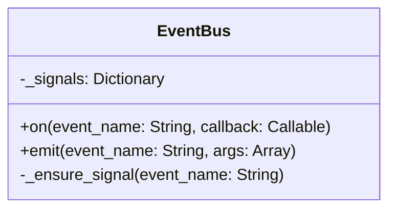
Sources: [core/event_bus.gd:5-18]()

### Key Methods

*   **`on(event_name: String, callback: Callable)`**: Connects a `Callable` object (typically a function or method) to a specified event. When `event_name` is emitted, the `callback` will be invoked. The `EventBus` ensures the signal exists before connecting. Sources: [core/event_bus.gd:12-14]()
*   **`emit(event_name: String, args: Array = [])`**: Emits the specified `event_name` with an optional array of arguments. All connected callbacks for that event will be triggered. The `EventBus` ensures the signal exists before emitting. Sources: [core/event_bus.gd:16-18]()
*   **`_ensure_signal(event_name: String)`**: An internal helper method that checks if a signal for `event_name` already exists in the `_signals` dictionary. If not, it creates a new `Signal` instance and stores it. Sources: [core/event_bus.gd:7-10]()

### Event Subscription and Emission Flow

This sequence diagram illustrates how a mod subscribes to an event and how that event is subsequently emitted by a hook script, triggering the mod's callback.

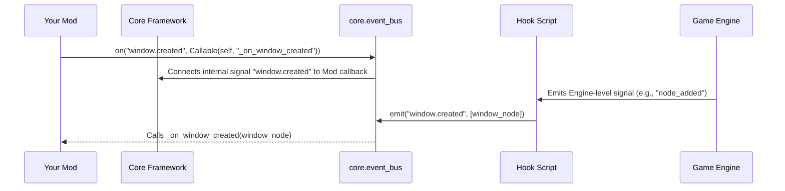
Sources: [README.md:35-36](), [core/event_bus.gd:12-18](), [core/hooks/window_hooks.gd:22-23]()

## Hooks System (`core.hooks`)

The Hooks System, exposed as `core.hooks`, is responsible for integrating with the game engine's native signals and translating them into the standardized events managed by the `EventBus`. This system acts as an adapter layer, allowing Core and dependent mods to react to low-level engine occurrences without directly interfacing with engine internals. Sources: [README.md:32-33](), [core/hooks/hook_manager.gd:3]()

### Hook Manager (`HookManager.gd`)

The `HookManager` (`core/hooks/hook_manager.gd`) is the central component of the Hooks System. It is responsible for initializing and managing individual hook scripts. Upon instantiation, the `HookManager` receives a reference to the `EventBus` and proceeds to register all predefined hook scripts. Each individual hook script is initialized with the `HookManager` instance, from which it obtains the `EventBus` reference to emit events. Sources: [core/hooks/hook_manager.gd:3-19]()

```mermaid
graph TD
    A[Core Singleton] -- Exposes --> B[core.event_bus (EventBus.gd)]
    A -- Exposes --> C[core.hooks (HookManager.gd)]

    C -- Initializes & Manages --> D1[WindowHooks.gd]
    C -- Initializes & Manages --> D2[ConnectionHooks.gd]
    C -- Initializes & Manages --> D3[SelectionHooks.gd]
    C -- Initializes & Manages --> D4[UIHooks.gd]
    C -- Initializes & Manages --> D5[SaveLoadHooks.gd]

    D1 -- Emits events to --> B
    D2 -- Emits events to --> B
    D3 -- Emits events to --> B
    D4 -- Emits events to --> B
    D5 -- Emits events to --> B

    E[Game Engine] -- Emits native signals --> D1
    E -- Emits native signals --> D2
    E -- Emits native signals --> D3
    E -- Emits native signals --> D4
    E -- Emits native signals --> D5

    F[Mod Developer] -- Subscribes to --> B
```
Sources: [README.md:32-33](), [core/event_bus.gd:3](), [core/hooks/hook_manager.gd:3-19](), [core/hooks/window_hooks.gd:3](), [core/hooks/connection_hooks.gd:3](), [core/hooks/selection_hooks.gd:3](), [core/hooks/ui_hooks.gd:3](), [core/hooks/save_load_hooks.gd:3]()

### Specific Hook Implementations

Each hook script is specialized to listen for particular game engine signals and translate them into a corresponding Core event. These scripts instantiate with a reference to the `HookManager` to access the `EventBus`. Sources: [core/hooks/window_hooks.gd:7-9](), [core/hooks/connection_hooks.gd:7-9](), [core/hooks/save_load_hooks.gd:7-9](), [core/hooks/selection_hooks.gd:7-9](), [core/hooks/ui_hooks.gd:7-9]()

#### Window Hooks (`WindowHooks.gd`)

This hook listens for nodes being added to or removed from the scene tree. It specifically checks if the added/removed node is a `Window` and emits `window.created` or `window.deleted` events accordingly. Sources: [README.md:35](), [core/hooks/window_hooks.gd:3-23]()

```gdscript
# core/hooks/window_hooks.gd
func _init(hook_manager: HookManager):
    _event_bus = hook_manager.event_bus
    get_tree().connect("node_added", Callable(self, "_on_node_added"))
    get_tree().connect("node_removed", Callable(self, "_on_node_removed"))

func _on_node_added(node: Node):
    if node is Window:
        _event_bus.emit("window.created", [node])
func _on_node_removed(node: Node):
    if node is Window:
        _event_bus.emit("window.deleted", [node])
```
Sources: [core/hooks/window_hooks.gd:7-23]()

#### Connection Hooks (`ConnectionHooks.gd`)

This hook listens for new connections being established within the game. When a connection is created, it emits the `connection.created` event. Sources: [README.md:35](), [core/hooks/connection_hooks.gd:3-13]()

#### Selection Hooks (`SelectionHooks.gd`)

This hook monitors changes in game selection. When the selection changes, it emits the `selection.changed` event. Sources: [README.md:35](), [core/hooks/selection_hooks.gd:3-13]()

#### UI Hooks (`UIHooks.gd`)

This hook is responsible for detecting UI popups. When a UI popup event occurs, it emits the `ui.popup` event. Sources: [README.md:35](), [core/hooks/ui_hooks.gd:3-13]()

#### Save/Load Hooks (`SaveLoadHooks.gd`)

This hook specifically listens for the game load event. Upon a successful game load, it emits the `save_load.loaded` event. Sources: [README.md:38](), [core/hooks/save_load_hooks.gd:3-13]()

### Supported Events

The following table summarizes the global lifecycle events supported by the Core framework's Event Bus and Hooks System, along with their primary source hooks.

| Event Name         | Description                                     | Primary Hook Script     |
| :----------------- | :---------------------------------------------- | :---------------------- |
| `window.created`   | A new window node has been added to the scene.  | `WindowHooks.gd`        |
| `window.deleted`   | A window node has been removed from the scene.  | `WindowHooks.gd`        |
| `connection.created` | A new connection has been established.          | `ConnectionHooks.gd`    |
| `selection.changed` | The in-game selection has changed.              | `SelectionHooks.gd`     |
| `ui.popup`         | A UI popup event has occurred.                  | `UIHooks.gd`            |
| `save_load.loaded` | The game save data has been successfully loaded.| `SaveLoadHooks.gd`      |
| `etc.`             | Other events may be supported.                  | (Other hook scripts)    |
Sources: [README.md:35-38]()

## Usage for Mod Developers

Mod developers can interact with the Event Bus to subscribe to these global events from their module entrypoints or other scripts. This allows for reactive programming, where mod logic can execute in response to specific game occurrences without needing to poll for changes or deeply integrate with game internals. Sources: [README.md:20-27]()

```gdscript
# In your module entrypoint
var core = Engine.has_meta("TajsCore") ? Engine.get_meta("TajsCore") : null
if core == null or not core.require("0.1.0"):
    return

# Listen for window creation
core.event_bus.on("window.created", Callable(self, "_on_window_created"))

# Hook into game load
core.event_bus.on("save_load.loaded", Callable(self, "_on_game_loaded"))

func _on_window_created(window_node):
    print("A new window was created: ", window_node.name)

func _on_game_loaded():
    print("Game save data loaded!")
```
Sources: [README.md:20-21](), [README.md:35-38]()

## Conclusion

The Event Bus and Hooks System forms a critical backbone of Taj's Core Framework, providing a clean, decoupled, and extensible way for mods to interact with the game environment. By centralizing event dispatch through `core.event_bus` and abstracting native engine signals via `core.hooks`, the framework ensures that mod developers can build robust and compatible extensions that respond effectively to key game events, thereby enhancing the overall modding experience for Upload Labs. Sources: [README.md:1-3]()

---

<a id='page-commands-undo'></a>

## Command and Undo System

### Related Pages

Related topics: [Settings, Migrations, and Persistent Data](#page-settings-data)

<details>
<summary>Relevant source files</summary>

- [README.md](https://github.com/TajsMods/Core/blob/main/README.md)
- [core/commands/command_registry.gd](https://github.com/TajsMods/Core/blob/main/core/commands/command_registry.gd)
- [core/commands/undo/undo_command.gd](https://github.com/TajsMods/Core/blob/main/core/commands/undo/undo_command.gd)
- [core/util/undo_manager.gd](https://github.com/TajsMods/Core/blob/main/core/util/undo_manager.gd)
- [core/util/undo_stack.gd](https://github.com/TajsMods/Core/blob/main/core/util/undo_stack.gd)
</details>

# Command and Undo System

The Command and Undo System in Taj's Core Framework provides structured mechanisms for executing operations and managing the history of reversible actions. It encompasses two primary components: a `CommandRegistry` for general-purpose palette commands and a dedicated Undo System built around `UndoCommand`, `UndoStack`, and `UndoManager` for managing reversible operations. This system allows other mods to integrate custom functionality and provide robust undo/redo capabilities within their features.

Taj's Core is an infrastructure-only framework designed for Upload Labs, providing stable services that other mods can depend on without introducing gameplay changes. The Command and Undo System is part of these core services, accessible globally via the `TajsCore` singleton. Sources: [README.md:1-2](), [README.md:9-10]()

## Command Registry

The `CommandRegistry` (`core.commands`) is a standard service within Taj's Core, intended for registering and executing palette commands. It allows modules to define actions that can be invoked by a unique identifier. Sources: [README.md:104](), [core/commands/command_registry.gd:1]()

### Architecture and Usage

The `CommandRegistry` class extends `Node` and maintains an internal dictionary `_commands` to store registered command data. Modules interact with this registry to register new commands, execute existing ones, or retrieve command information.

Here is an overview of the `CommandRegistry`'s structure and its key methods:

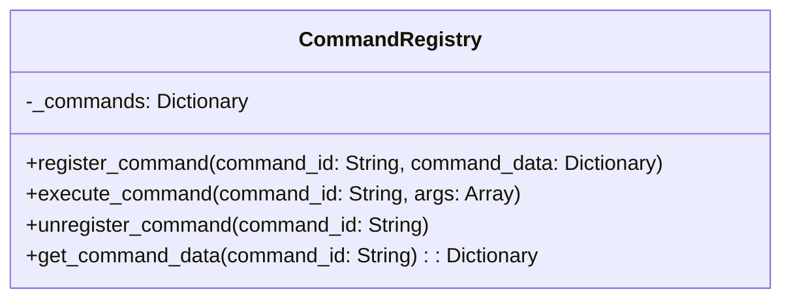
Sources: [core/commands/command_registry.gd:3-37]()

### Key Methods

| Method Name           | Description                                                                                                                                                                    |
| :-------------------- | :----------------------------------------------------------------------------------------------------------------------------------------------------------------------------- |
| `register_command`    | Registers a new command with a unique `command_id` and associated `command_data`, which typically includes a `Callable` for the command's action. Sources: [core/commands/command_registry.gd:8-16]() |
| `execute_command`     | Executes the command identified by `command_id`, passing any provided `args` to its associated `Callable`. Sources: [core/commands/command_registry.gd:18-28]()                   |
| `unregister_command`  | Removes a command from the registry using its `command_id`. Sources: [core/commands/command_registry.gd:30-33]()                                                                 |
| `get_command_data`    | Retrieves the `command_data` dictionary for a given `command_id`. Sources: [core/commands/command_registry.gd:35-37]()                                                          |

## Undo System Overview

The Undo System provides a robust mechanism for implementing undo and redo functionality for arbitrary actions. It is composed of three main components: `UndoCommand`, `UndoStack`, and `UndoManager`. This system allows for the execution of actions that can be subsequently reverted and reapplied. Sources: [core/commands/undo/undo_command.gd](), [core/util/undo_manager.gd](), [core/util/undo_stack.gd]()

The following diagram illustrates the relationships between these components:

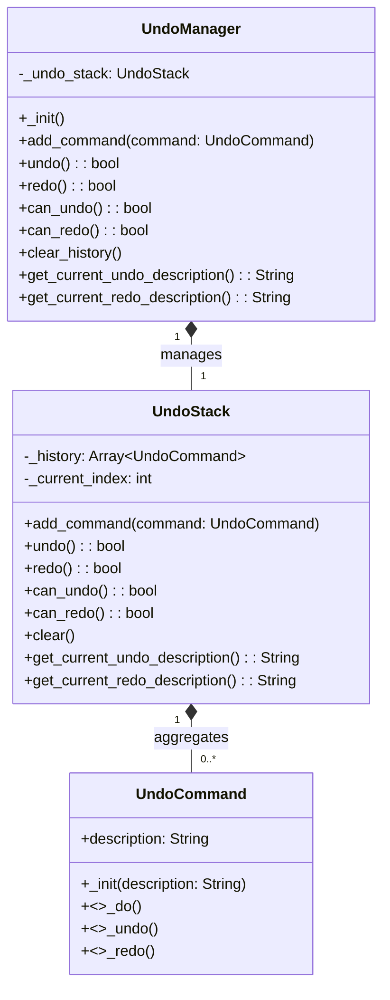
Sources: [core/commands/undo/undo_command.gd](), [core/util/undo_manager.gd](), [core/util/undo_stack.gd]()

## UndoCommand

`UndoCommand` is an abstract base class (`RefCounted`) that defines the interface for any action that can be undone and redone. Concrete actions must inherit from `UndoCommand` and implement its abstract methods. Each command has a `description` property for user-facing context. Sources: [core/commands/undo/undo_command.gd:1-20]()

### Abstract Methods

*   `_do()`: This method is called to perform the initial action.
*   `_undo()`: This method is called to revert the action performed by `_do()`.
*   `_redo()`: This method is called to re-perform the action after it has been undone.

A typical implementation of an `UndoCommand` subclass would look like this:

```gdscript
# core/commands/undo/undo_command.gd
class_name UndoCommand
extends RefCounted

var description: String = "No description"

func _init(description: String = "No description"):
    self.description = description

func _do() -> void:
    # Override to perform the action.
    pass

func _undo() -> void:
    # Override to revert the action.
    pass

func _redo() -> void:
    # Override to re-perform the action after undo.
    pass
```
Sources: [core/commands/undo/undo_command.gd:1-20]()

## UndoStack

The `UndoStack` (`RefCounted`) manages the history of `UndoCommand` objects. It maintains an array `_history` of `UndoCommand` instances and a `_current_index` indicating the position of the last executed command. This structure allows for navigating forward and backward through the command history. Sources: [core/util/undo_stack.gd:1-5]()

### Key Methods

*   `add_command(command: UndoCommand)`: Adds a new `UndoCommand` to the history. If the `_current_index` is not at the end of the history, any commands beyond the current index are cleared before the new command is added. The new command's `_do()` method is immediately called. Sources: [core/util/undo_stack.gd:7-23]()
*   `undo()`: Reverts the last executed command by calling its `_undo()` method and decrements `_current_index`. Returns `true` if successful, `false` otherwise. Sources: [core/util/undo_stack.gd:25-34]()
*   `redo()`: Re-applies the next command in the history by calling its `_redo()` method and increments `_current_index`. Returns `true` if successful, `false` otherwise. Sources: [core/util/undo_stack.gd:36-45]()
*   `can_undo()`: Returns `true` if there are commands available to undo (`_current_index >= 0`). Sources: [core/util/undo_stack.gd:47-49]()
*   `can_redo()`: Returns `true` if there are commands available to redo (`_current_index < _history.size() - 1`). Sources: [core/util/undo_stack.gd:51-53]()
*   `clear()`: Clears the entire command history and resets the `_current_index`. Sources: [core/util/undo_stack.gd:55-58]()
*   `get_current_undo_description()`: Returns the description of the command that would be undone next. Sources: [core/util/undo_stack.gd:60-64]()
*   `get_current_redo_description()`: Returns the description of the command that would be redone next. Sources: [core/util/undo_stack.gd:66-70]()

### Sequence of Operations

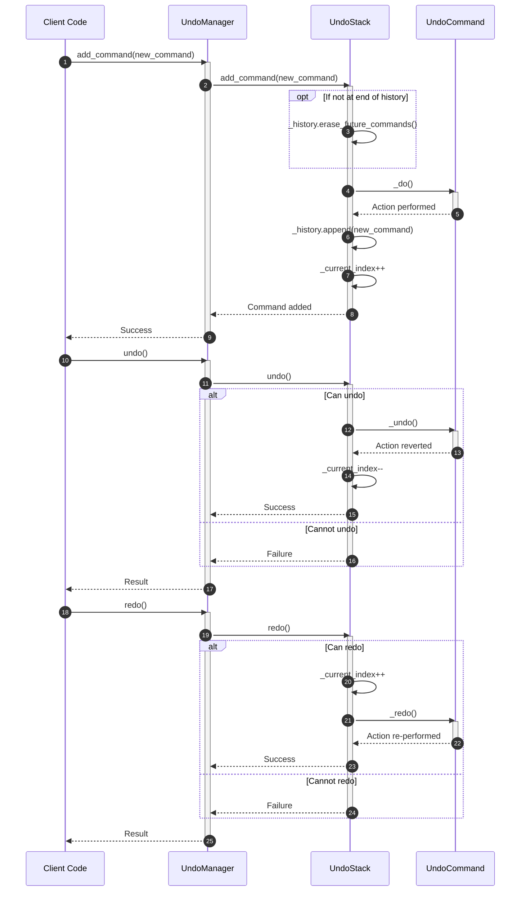
Sources: [core/util/undo_stack.gd:7-45](), [core/util/undo_manager.gd:10-20]()

## UndoManager

The `UndoManager` (`Node`) acts as the primary interface for the Undo System. It holds an instance of `UndoStack` and delegates all undo/redo operations to it. This design provides a facade pattern, simplifying interaction with the Undo System for external modules. The `UndoManager` is likely intended to be a singleton, consistent with other Core services, making undo/redo functionality easily accessible throughout the application. Sources: [core/util/undo_manager.gd:1-40]()

### Functionality

The `UndoManager` exposes methods that mirror the `UndoStack`'s functionality, including:

*   `add_command(command: UndoCommand)`: Adds a command to the undo history. Sources: [core/util/undo_manager.gd:10-12]()
*   `undo()`: Reverts the last command. Sources: [core/util/undo_manager.gd:14-16]()
*   `redo()`: Re-applies the next command. Sources: [core/util/undo_manager.gd:18-20]()
*   `can_undo()`: Checks if an undo operation is possible. Sources: [core/util/undo_manager.gd:22-24]()
*   `can_redo()`: Checks if a redo operation is possible. Sources: [core/util/undo_manager.gd:26-28]()
*   `clear_history()`: Clears the entire undo history. Sources: [core/util/undo_manager.gd:30-32]()
*   `get_current_undo_description()`: Retrieves the description of the command to be undone. Sources: [core/util/undo_manager.gd:34-36]()
*   `get_current_redo_description()`: Retrieves the description of the command to be redone. Sources: [core/util/undo_manager.gd:38-40]()

## Conclusion

The Command and Undo System in Taj's Core provides fundamental infrastructure for managing both general-purpose palette commands and a comprehensive undo/redo history. The `CommandRegistry` offers a centralized way to define and execute actions, while the `UndoManager`, `UndoStack`, and `UndoCommand` collectively enable the implementation of reversible operations. This architecture ensures that mods built on Taj's Core can integrate complex, user-friendly features with reliable command and history management.
Error: Invalid operation: The `response.text` quick accessor requires the response to contain a valid `Part`, but none were returned. The candidate's [finish_reason](https://ai.google.dev/api/generate-content#finishreason) is 1.

---

<a id='page-settings-data'></a>

## Settings, Migrations, and Persistent Data

### Related Pages

Related topics: [Command and Undo System](#page-commands-undo), [Feature Flags and Localization](#page-features-l10n)

<details>
<summary>Relevant source files</summary>

- [README.md](https://github.com/TajsMods/Core/blob/main/README.md)
- [core/settings.gd](https://github.com/TajsMods/Core/blob/main/core/settings.gd)
- [core/migrations.gd](https://github.com/TajsMods/Core/blob/main/core/migrations.gd)
- [core/core.gd](https://github.com/TajsMods/Core/blob/main/core/core.gd)
- [core/features.gd](https://github.com/TajsMods/Core/blob/main/core/features.gd)
- [manifest.json](https://github.com/TajsMods/Core/blob/main/manifest.json)
</details>

# Settings, Migrations, and Persistent Data

Taj's Core Framework is an infrastructure-only mod designed to provide stable services for other mods without introducing gameplay changes. A crucial aspect of this framework is its robust handling of persistent data, including user-configurable settings, versioned data migrations, and toggleable feature flags. These systems ensure that mods can store and retrieve data reliably, maintain compatibility across Core updates, and offer flexible user options.

The `Core` singleton exposes these services, allowing dependent modules to interact with persistent data through `core.settings`, `core.migrations`, and `core.features`. This centralized approach simplifies data management for mod developers and enhances the overall stability and extensibility of the modding ecosystem.

## Core Singleton Access and Initialization

Before utilizing any of Core's services, including settings and migrations, a dependent mod must first access the `Core` singleton and verify its version. The `Core` singleton registers itself globally in the Godot `Engine` metadata. Upon initialization, `Core` sets up its various subsystems, including `Settings` and `Migrations`.

The following diagram illustrates the typical access pattern for a dependent module:

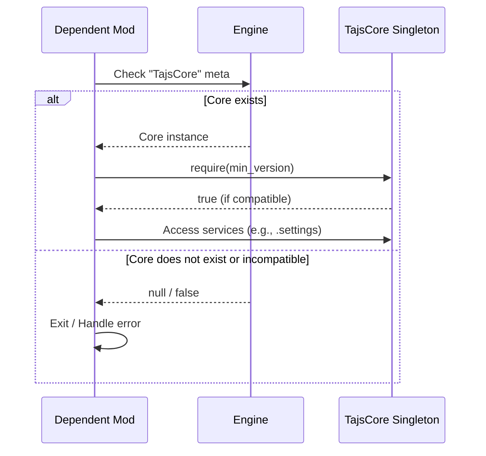
Sources: [README.md:6-15](), [core/core.gd:12](), [core/core.gd:25-30]()

The `Core` class initializes its `Settings`, `Migrations`, and `Features` services in its `_ready()` method. This ensures that these essential services are available immediately after Core is loaded and registered.

```mermaid
graph TD
    A[Core Singleton] --> B{_ready()};
    B --> C[Initialize Settings];
    B --> D[Initialize Migrations];
    B --> E[Initialize Features];
    C --> F[settings.load_settings()];
    D --> G[migrations.run_migrations(Core._VERSION)];
```
Sources: [core/core.gd:14-23]()

## Settings Management (`core.settings`)

The `Settings` service provides a persistent store for user configurations and mod-specific options. It manages loading and saving settings to a JSON file located in the user's data directory.

### Storage and Structure

Settings are stored in a file named `tajs_core_settings.json` within the `user://` directory. Internally, settings are managed as a dictionary.

```mermaid
classDiagram
    class Settings {
        +String settings_file_path
        -Dictionary _settings
        +get_setting(key, default_value)
        +set_setting(key, value)
        +save_settings()
        +load_settings()
        -_on_game_saved()
        -_on_game_loaded()
    }
```
Sources: [core/settings.gd:1-55]()

### Key Functions

The `Settings` class exposes methods for interacting with the persistent store:

| Method                 | Description                                                                     | Source                 |
| :--------------------- | :------------------------------------------------------------------------------ | :--------------------- |
| `get_setting(key, default_value)` | Retrieves a setting value by key. Returns `default_value` if the key is not found. | [core/settings.gd:11-15]() |
| `set_setting(key, value)`       | Sets a setting value for a given key.                                           | [core/settings.gd:17-20]() |
| `save_settings()`      | Persists the current in-memory settings dictionary to the JSON file.            | [core/settings.gd:22-31]() |
| `load_settings()`      | Loads settings from the JSON file into the in-memory dictionary. If the file does not exist or is invalid, it initializes an empty dictionary. | [core/settings.gd:33-46]() |

Settings are automatically loaded when the `Settings` node is ready and can be explicitly saved. The `Settings` service also hooks into game save/load events, though the provided `_on_game_saved()` and `_on_game_loaded()` methods primarily call `save_settings()` and `load_settings()` respectively.

## Migrations System (`core.migrations`)

The `Migrations` service ensures data compatibility and allows for schema evolution across different versions of Core. It provides a mechanism to define and execute version-specific updates to persistent data.

### Migration Process

The migration system operates by comparing the current Core version with the version for which migrations have been registered. Migrations are executed in ascending order of their version numbers.

```mermaid
flowchart TD
    A[Core Initialization] --> B{Call migrations.run_migrations(Core._VERSION)};
    B --> C[Get Current Core Version from manifest.json];
    C --> D{Iterate Registered Migrations};
    D -- For each migration M --> E{Compare M.version with Current Core Version};
    E -- If M.version <= Current Core Version --> F[Execute M.callable()];
    F --> D;
    D -- All migrations processed --> G[Migrations Complete];
```
Sources: [core/migrations.gd:12-25](), [core/core.gd:17]()

### Key Functions

The `Migrations` class provides methods to manage and execute migrations:

| Method                               | Description                                                                     | Source                 |
| :----------------------------------- | :------------------------------------------------------------------------------ | :--------------------- |
| `add_migration(version, callable)`   | Registers a migration function (`callable`) to be run for a specific `version`. | [core/migrations.gd:7-10]() |
| `run_migrations(current_core_version)` | Executes all registered migrations whose versions are less than or equal to `current_core_version`. | [core/migrations.gd:12-25]() |
| `get_current_core_version()`         | Retrieves the current Core version from `manifest.json`.                      | [core/migrations.gd:27-29]() |

The `current_core_version` passed to `run_migrations` comes from `Core._VERSION` (e.g., "1.1.0"). The `get_current_core_version()` method, however, reads the `version_number` from the `manifest.json` file.

```json
{
	"name": "Core",
	"namespace": "TajemnikTV",
	"version_number": "1.1.0",
	"website_url": "https://github.com/TajsMods/Core"
}
```
Sources: [manifest.json:28-31]()

## Feature Flags (`core.features`)

The `Features` service allows mod developers to define toggleable features, which are backed by the `Settings` system. This enables dynamic control over mod functionalities, often configurable by the user.

### Feature Management

Features are registered with a unique ID, a default value, and a description. Their enabled state is stored and retrieved using `core.settings`.

```mermaid
graph TD
    A[Core Singleton] --> B[Features Service];
    B --> C[Settings Service];

    subgraph Feature Registration
        ModDev[Mod Developer] --> D{features.register_feature(id, default_value, description)};
        D --> E[Store feature metadata in _features dictionary];
        E --> F[Generate setting key for feature (e.g., "feature_id_enabled")];
        F --> G[settings.set_setting(setting_key, default_value) if not exists];
    end

    subgraph Feature Check
        Mod[Dependent Mod] --> H{features.is_feature_enabled(id)};
        H --> I[Get setting key for feature];
        I --> J[settings.get_setting(setting_key, default_value)];
        J --> Mod;
    end
```
Sources: [core/features.gd:1-27](), [README.md:88-91]()

### Key Functions

The `Features` class provides methods for managing feature flags:

| Method                                      | Description                                                                     | Source                 |
| :------------------------------------------ | :------------------------------------------------------------------------------ | :--------------------- |
| `register_feature(id, default_value, description)` | Registers a new feature with a unique `id`, `default_value`, and `description`. The default value is used if the setting doesn't exist. | [core/features.gd:11-15]() |
| `is_feature_enabled(id)`                    | Checks if a feature is currently enabled. It queries the `core.settings` for the feature's state. | [core/features.gd:17-20]() |
| `get_feature_setting_key(id)`               | Generates the internal setting key used to store the feature's state in `core.settings`. | [core/features.gd:22]() |
| `get_feature_description(id)`               | Retrieves the description of a registered feature.                              | [core/features.gd:24-27]() |

Example of using feature flags from a dependent module:
```gdscript
core.features.register_feature("my_feature", true, "Enable my cool feature")
if core.features.is_feature_enabled("my_feature"):
    # Perform actions if the feature is enabled
    pass
```
Sources: [README.md:88-91]()

## Conclusion

The `Settings`, `Migrations`, and `Features` systems within Taj's Core Framework provide a robust foundation for managing persistent data and dynamic functionalities for dependent mods. By offering centralized services for configuration, version-controlled data updates, and toggleable features, Core ensures stability, compatibility, and a flexible user experience, allowing mod developers to focus on gameplay mechanics rather than boilerplate infrastructure.

---

<a id='page-ui-theming'></a>

## UI Management and Theming

### Related Pages

Related topics: [Node and Window Management](#page-node-window), [Feature Flags and Localization](#page-features-l10n)

<details>
<summary>Relevant source files</summary>

The following files were used as context for generating this wiki page:

- [README.md](https://github.com/TajsMods/Core/blob/main/README.md)
- [core/theme_manager.gd](https://github.com/TajsMods/Core/blob/main/core/theme_manager.gd)
- [core/assets.gd](https://github.com/TajsMods/Core/blob/main/core/assets.gd)
- [core/ui/icon_browser.gd](https://github.com/TajsMods/Core/blob/main/core/ui/icon_browser.gd)
- [core/nodes.gd](https://github.com/TajsMods/Core/blob/main/core/nodes.gd)
- [core/window_menus.gd](https://github.com/TajsMods/Core/blob/main/core/window_menus.gd)
- [core/localization.gd](https://github.com/TajsMods/Core/blob/main/core/localization.gd)
- [textures/icons/](https://github.com/TajsMods/Core/blob/main/textures/icons/)
</details>

# UI Management and Theming

Taj's Core Framework provides an infrastructure-only foundation for mod development within Upload Labs, offering stable services that other mods can depend on without introducing gameplay changes. A significant aspect of this framework is its comprehensive UI Management and Theming system, designed to facilitate the integration of custom user interfaces and maintain a consistent visual style across various mod functionalities. Sources: [README.md:1-3]()

This system encompasses functionalities for registering custom nodes and windows, managing window categories and menus, handling UI assets like icons, applying themes, and supporting localization for UI text. It enables mod developers to extend the game's user interface seamlessly while leveraging Core's robust services. Sources: [README.md:23-26](), [README.md:32-34](), [README.md:38-40](), [README.md:60-62](), [README.md:68-70]()

## Accessing Core Services

Mods interact with Core by first obtaining its global singleton instance. This ensures that all modules operate within the same framework context and can access the provided services consistently. Sources: [README.md:5-7]()

The process for accessing the Core singleton is as follows:

```gdscript
var core = Engine.has_meta("TajsCore") ? Engine.get_meta("TajsCore") : null
if core == null or not core.require("0.1.0"): # Example version check
    return
```
Sources: [README.md:5-7](), [README.md:12-14]()

This flow can be visualized as:

```mermaid
graph TD
    A[Mod Entrypoint] --> B{Engine has "TajsCore" meta?};
    B -- Yes --> C[Get "TajsCore" meta];
    B -- No --> D[Core is null];
    C --> E[Assign to 'core' variable];
    E --> F{Core is null or version check fails?};
    F -- Yes --> G[Return / Abort Mod Load];
    F -- No --> H[Use Core Services];
```
Sources: [README.md:5-7](), [README.md:12-14]()

## Node Registry (`core.nodes`)

The `core.nodes` service is central to UI management, allowing mods to register custom window nodes and define custom categories within the game's UI. This enables dynamic extension of the game's interface with mod-specific windows. Sources: [README.md:23-26](), [core/nodes.gd:1-2]()

### Registering Nodes

Nodes are registered using the `register_node` function, which accepts a dictionary of node data. This data includes essential information for displaying and managing the custom window. Sources: [core/nodes.gd:16-20]()

```gdscript
# Register a simple window node
core.nodes.register_node({
    "id": "MyMod.MyWindow",
    "display_name": "My Window",
    "category": "utility",
    "packed_scene_path": "res://scenes/windows/my_window.tscn", 
    "attributes": { "limit": 1 }
})
```
Sources: [README.md:27-33]()

The `register_node` function parameters are:

| Parameter           | Type     | Description                                                          | Source                      |
| :------------------ | :------- | :------------------------------------------------------------------- | :-------------------------- |
| `id`                | `String` | Unique identifier for the node.                                      | [core/nodes.gd:17]()        |
| `display_name`      | `String` | User-friendly name shown in the UI.                                  | [core/nodes.gd:17]()        |
| `category`          | `String` | Category ID for grouping nodes in menus.                             | [core/nodes.gd:17]()        |
| `packed_scene_path` | `String` | Path to the `.tscn` file for the window scene.                       | [core/nodes.gd:17]()        |
| `attributes`        | `Dictionary` | Optional attributes, e.g., `{"limit": 1}` for single instance. | [core/nodes.gd:17]()        |

### Registering Window Categories

Mods can also define new categories to organize their custom windows more effectively. These categories appear in relevant UI menus, often with a custom icon. Sources: [README.md:35](), [core/nodes.gd:22-23]()

```gdscript
# Register a custom category in the Windows menu
core.nodes.register_window_category("my_category", "My Stuff", "res://icon.png")
```
Sources: [README.md:35]()

The `register_window_category` function parameters are:

| Parameter      | Type     | Description                                         | Source                      |
| :------------- | :------- | :-------------------------------------------------- | :-------------------------- |
| `category_id`  | `String` | Unique identifier for the category.                 | [core/nodes.gd:22]()        |
| `display_name` | `String` | User-friendly name for the category.                | [core/nodes.gd:22]()        |
| `icon_path`    | `String` | Path to the icon resource for the category.         | [core/nodes.gd:22]()        |

## Window Management

Core provides specialized services for managing window scenes and integrating custom tabs into the OS window menu.

### Window Scenes (`core.window_scenes`)

The `core.window_scenes` service allows mods to register directories containing their window scenes, facilitating path resolution across different mods. This ensures that Core can correctly locate and instantiate window scenes regardless of the mod's specific file structure. Sources: [README.md:38-40]()

```gdscript
core.window_scenes.register_mod_dir("MyMod", "scenes/windows")
```
Sources: [README.md:41]()

### Window Menus (`core.window_menus`)

The `core.window_menus` service enables mods to add custom buttons or tabs to the game's OS window menu, providing quick access to mod-specific functionalities directly from the main UI. Sources: [README.md:44-46](), [core/window_menus.gd:1-2]()

```gdscript
core.window_menus.register_tab("MyMod", "my_tab", {
    "button_name": "My Tab",
    "icon": "my_icon.png"
})
```
Sources: [README.md:47-50]()

The `register_tab` function parameters are:

| Parameter     | Type       | Description                                              | Source                        |
| :------------ | :--------- | :------------------------------------------------------- | :---------------------------- |
| `mod_id`      | `String`   | Identifier of the mod registering the tab.               | [core/window_menus.gd:13]()   |
| `tab_id`      | `String`   | Unique identifier for the tab.                           | [core/window_menus.gd:13]()   |
| `tab_data`    | `Dictionary` | Dictionary containing tab properties.                    | [core/window_menus.gd:13]()   |
| `tab_data.button_name` | `String`   | Text displayed on the tab button.                        | [README.md:48]()              |
| `tab_data.icon`        | `String`   | Name of the icon for the tab button (resolved via `core.assets`). | [README.md:49]()              |

## Asset Management (`core.assets`)

The `core.assets` service provides functionalities to load and cache assets, especially icons, while resolving their paths relative to mod options. This streamlines the process of integrating visual elements into the UI. Sources: [README.md:60-62](), [core/assets.gd:1-2]()

The `load_icon` function is a helper for specifically loading icon textures.

```gdscript
# Load an icon from your mod's 'textures/icons' folder
var icon = core.assets.load_icon("my_icon.png", "MyMod")
```
Sources: [README.md:63-64]()

The process of loading an icon involves path resolution and caching:

```mermaid
sequenceDiagram
    participant Mod as Mod Code
    participant CoreAssets as core.assets
    participant Engine as Godot Engine

    Mod->>CoreAssets: load_icon("my_icon.png", "MyMod")
    activate CoreAssets
    CoreAssets->>CoreAssets: Check Asset Cache
    alt Icon in Cache
        CoreAssets-->>Mod: Return Cached Icon
    else Icon not in Cache
        CoreAssets->>CoreAssets: Resolve Path (e.g., "res://mods/MyMod/textures/icons/my_icon.png")
        CoreAssets->>Engine: load(resolved_path)
        activate Engine
        Engine-->>CoreAssets: Loaded Texture
        deactivate Engine
        CoreAssets->>CoreAssets: Store in Cache
        CoreAssets-->>Mod: Return Loaded Texture
    end
    deactivate CoreAssets
```
Sources: [core/assets.gd:17-27](), [core/assets.gd:32-34](), [textures/icons/]()

## Icon Browser (`core.ui.icon_browser`)

The `core.ui.icon_browser` is a specific UI control designed to display a collection of icons, allowing users to browse and select them. It extends Godot's `Control` node and leverages the `core.assets` service to load the icons it presents. Sources: [core/ui/icon_browser.gd:1-2](), [core/ui/icon_browser.gd:8-10]()

The icon browser populates itself during its `_ready` lifecycle method by calling `_populate_icons()`. Each icon is displayed as a `TextureRect` wrapped in a `Button`, emitting an `icon_selected` signal upon user interaction. Sources: [core/ui/icon_browser.gd:12-14](), [core/ui/icon_browser.gd:22-26]()

## Theme Manager (`core.theme_manager`)

The `core.theme_manager` service provides a centralized way to register and apply UI themes across the application. This ensures a consistent visual style and allows for easy switching between different themes. Sources: [README.md:68-70](), [core/theme_manager.gd:1-2]()

### Registering Themes

Themes are registered with a unique ID and a Godot `Theme` resource.

```gdscript
core.theme_manager.register_theme("dark_mode", load("res://themes/dark.tres"))
```
Sources: [README.md:71]()

The `register_theme` function parameters are:

| Parameter        | Type       | Description                                      | Source                          |
| :--------------- | :--------- | :----------------------------------------------- | :------------------------------ |
| `theme_id`       | `String`   | Unique identifier for the theme.                 | [core/theme_manager.gd:15]()    |
| `theme_resource` | `Resource` | The Godot `Theme` resource to be registered.     | [core/theme_manager.gd:15]()    |

### Applying Themes

Once registered, a theme can be applied to any `Control` node.

```gdscript
core.theme_manager.apply_theme(my_control, "dark_mode")
```
Sources: [README.md:72]()

The `apply_theme` function parameters are:

| Parameter      | Type      | Description                                          | Source                          |
| :------------- | :-------- | :--------------------------------------------------- | :------------------------------ |
| `control_node` | `Control` | The UI control node to which the theme will be applied. | [core/theme_manager.gd:17]()    |
| `theme_id`     | `String`  | The ID of the registered theme to apply.             | [core/theme_manager.gd:17]()    |

The `ThemeManager` manages registered themes and the currently active theme:

```mermaid
classDiagram
    class ThemeManager {
        -Dictionary _registered_themes
        -String _current_theme_id
        +register_theme(theme_id, theme_resource)
        +apply_theme(control_node, theme_id)
        +get_current_theme_id() String
        +get_theme_resource(theme_id) Resource
    }
```
Sources: [core/theme_manager.gd:4-6](), [core/theme_manager.gd:15](), [core/theme_manager.gd:17](), [core/theme_manager.gd:19](), [core/theme_manager.gd:21]()

## Localization (`core.localization`)

The `core.localization` service allows mods to register their translation directories, which are then automatically added to Godot's `TranslationServer`. This ensures that all UI text can be properly localized for different languages. Sources: [README.md:76-78](), [core/localization.gd:1-2]()

```gdscript
core.localization.register_mod_translations("MyMod", "translations")
```
Sources: [README.md:79]()

The `register_mod_translations` function parameters are:

| Parameter           | Type     | Description                                                                  | Source                        |
| :------------------ | :------- | :--------------------------------------------------------------------------- | :---------------------------- |
| `mod_id`            | `String` | Unique identifier of the mod.                                                | [core/localization.gd:13]()   |
| `translation_dir_path` | `String` | The path to the directory containing translation files (e.g., `.po` files). | [core/localization.gd:13]()   |

## Conclusion

The UI Management and Theming services within Taj's Core Framework provide a robust and extensible system for mod developers to integrate and style their custom user interfaces. By centralizing functionalities like node and window registration, asset loading, theme application, and localization, Core ensures consistency and simplifies development, allowing mods to seamlessly extend the Upload Labs game experience with rich and well-integrated UI elements. Sources: [README.md:1-3](), [README.md:23-26](), [README.md:38-40](), [README.md:60-62](), [README.md:68-70](), [README.md:76-78]()

---

<a id='page-game-ext'></a>

## Extending Game Mechanics

### Related Pages

Related topics: [Module Integration and Lifecycle](#page-module-integration)

<details>
<summary>Relevant source files</summary>

The following files were used as context for generating this wiki page:

- [README.md](https://github.com/TajsMods/Core/blob/main/README.md)
- [core/mechanics/upgrade_caps.gd](https://github.com/TajsMods/Core/blob/main/core/mechanics/upgrade_caps.gd)
- [core/tree_registry.gd](https://github.com/TajsMods/Core/blob/main/core/tree_registry.gd)
- [core/nodes.gd](https://github.com/TajsMods/Core/blob/main/core/nodes.gd)
- [core/event_bus.gd](https://github.com/TajsMods/Core/blob/main/core/event_bus.gd)
- [core/features.gd](https://github.com/TajsMods/Core/blob/main/core/features.gd)
</details>

# Extending Game Mechanics

Taj's Core Framework serves as an infrastructure-only mod for Upload Labs, providing stable services that other mods can utilize to extend game mechanics without introducing direct gameplay changes. This framework offers various subsystems to register custom content, modify existing game limits, inject new elements into core game systems, and react to game events. It aims to create a modular and extensible environment for mod developers. Sources: [README.md:1-2]()

This document details the primary mechanisms within Core for extending game mechanics, including modifying upgrade limits, injecting nodes into game trees, managing custom UI elements, handling global events, and controlling features via flags.

## Core Access and Module Registration

Mods interact with Core by retrieving a global singleton registered via `Engine` metadata. After obtaining the Core singleton, mods must verify its version and then register themselves with Core's module system. This ensures compatibility and allows Core to manage dependencies and provide services to registered modules. Sources: [README.md:6-20]()

The process for a module to access and register with Core is as follows:

```mermaid
sequenceDiagram
    participant Mod as Your Mod
    participant Engine
    participant Core as TajsCore
    autonumber
    Mod->>Engine: has_meta("TajsCore")?
    Engine-->>Mod: Core Singleton Exists?
    alt Core Exists
        Mod->>Engine: get_meta("TajsCore")
        Engine-->>Mod: Core Singleton Instance
        Mod->>Core: require("0.1.0")
        Core-->>Mod: Version Check Result
        alt Version Compatible
            Mod->>Core.modules: register_module(ModuleConfig)
            Core.modules-->>Mod: Module Registered
        else Version Incompatible
            Mod->>Mod: Return (Initialization Failed)
        end
    else Core Does Not Exist
        Mod->>Mod: Return (Initialization Failed)
    end
```
Sources: [README.md:6-20]()

A module's registration object typically includes an `id`, `name`, `version`, and `min_core_version` to specify its identity and compatibility requirements. Sources: [README.md:14-19]()

## Extending Upgrade Limits (`core.upgrade_caps`)

The `core.upgrade_caps` subsystem allows mods to extend vanilla upgrade limits within Upload Labs purely through configuration. This provides a non-invasive way to balance or expand gameplay progression. Sources: [README.md:54-55]()

### Registering Extended Caps

Mods can register an extended cap by providing an ID for the upgrade and a dictionary of attributes, including the `extended_cap` value and a `cost_multiplier`.

```gdscript
core.upgrade_caps.register_extended_cap("processor_speed", {
    "extended_cap": 20, # Vanilla is 10
    "cost_multiplier": 1.5
})
```
Sources: [README.md:57-61]()

### Extended Cap Configuration

| Parameter         | Type      | Description                                     |
| :---------------- | :-------- | :---------------------------------------------- |
| `id`              | `String`  | Unique identifier for the upgrade cap.          |
| `extended_cap`    | `Number`  | The new maximum limit for the upgrade.          |
| `cost_multiplier` | `Number`  | Multiplier applied to the upgrade cost beyond vanilla limits. |
Sources: [README.md:57-61]()

## Injecting Tree Nodes (`core.tree_registry`)

The `core.tree_registry` subsystem enables mods to inject custom nodes into existing game trees, such as Research and Ascension trees. This allows for the expansion of progression paths and the introduction of new unlockable content. Sources: [README.md:64-65]()

### Adding Research Nodes

A mod can add a research node by specifying its name, position (`x`, `y`), and optionally a `ref` node to position it relative to an existing node.

```gdscript
core.tree_registry.add_research_node({
    "name": "MyResearch",
    "x": 100, "y": 200,
    "ref": "ExistingNode" # Position relative to this node
})
```
Sources: [README.md:67-71]()

### Research Node Configuration

| Parameter | Type     | Description                                     |
| :-------- | :------- | :---------------------------------------------- |
| `name`    | `String` | Display name of the research node.              |
| `x`       | `Number` | X-coordinate for node placement.                |
| `y`       | `Number` | Y-coordinate for node placement.                |
| `ref`     | `String` | Optional. ID of an existing node for relative positioning. |
Sources: [README.md:67-71]()

The conceptual flow for adding a research node is:

```mermaid
graph TD
    A[Mod Initiates] --> B{Call add_research_node};
    B --> C{Provide Node Config};
    C --> D{Core.tree_registry Processes};
    D --> E[Inject Node into Research Tree];
    E --> F[New Node Available];
```
Sources: [README.md:64-71]()

## Node and Window Management

Core provides comprehensive services for managing custom nodes and UI elements through `core.nodes`, `core.window_scenes`, and `core.window_menus`.

### Node Registry (`core.nodes`)

The `core.nodes` service allows mods to register custom window nodes and resources, defining their properties and behavior within the game's UI. Sources: [README.md:27-28]()

#### Registering Custom Nodes

Custom nodes are registered with an ID, display name, category, packed scene path, and optional attributes.

```gdscript
core.nodes.register_node({
    "id": "MyMod.MyWindow",
    "display_name": "My Window",
    "category": "utility",
    "packed_scene_path": "res://scenes/windows/my_window.tscn", 
    "attributes": { "limit": 1 }
})
```
Sources: [README.md:30-35]()

#### Registering Window Categories

Mods can also define custom categories for the Windows menu to organize their registered nodes.

```gdscript
core.nodes.register_window_category("my_category", "My Stuff", "res://icon.png")
```
Sources: [README.md:37]()

#### `register_node` Parameters

| Parameter         | Type       | Description                                       |
| :---------------- | :--------- | :------------------------------------------------ |
| `id`              | `String`   | Unique identifier for the node.                   |
| `display_name`    | `String`   | Name displayed in the UI.                         |
| `category`        | `String`   | Category for grouping in menus (e.g., "utility"). |
| `packed_scene_path` | `String`   | Path to the `.tscn` file for the node.            |
| `attributes`      | `Dictionary` | Optional. Additional configuration like `limit`.  |
Sources: [README.md:30-35]()

### Window Scenes (`core.window_scenes`)

This service helps resolve paths for window scenes across different mods by registering directories containing them. Sources: [README.md:40-41]()

```gdscript
core.window_scenes.register_mod_dir("MyMod", "scenes/windows")
```
Sources: [README.md:42]()

### Window Menus (`core.window_menus`)

Mods can add custom buttons or tabs to the OS window menu using this service. Sources: [README.md:45-46]()

```gdscript
core.window_menus.register_tab("MyMod", "my_tab", {
    "button_name": "My Tab",
    "icon": "my_icon.png"
})
```
Sources: [README.md:47-50]()

## Event-Driven Extensions (`core.hooks`)

The `core.hooks` system, powered by `core.event_bus`, allows mods to listen for and react to global lifecycle events within the game. This enables dynamic interaction with game state changes and integration with various game systems. Sources: [README.md:53-54]()

### Subscribing to Events

Mods can subscribe to events using the `on` method of `core.event_bus`, providing the event name and a `Callable` object for the callback function.

```gdscript
# Listen for window creation
core.event_bus.on("window.created", Callable(self, "_on_window_created"))

# Hook into game load
core.event_bus.on("save_load.loaded", Callable(self, "_on_game_loaded"))
```
Sources: [README.md:56-59]()

### Event Subscription Flow

```mermaid
sequenceDiagram
    participant Mod as Your Mod
    participant Core as TajsCore
    participant EventBus as Core.event_bus
    participant GameSystem as Game System
    autonumber
    Mod->>EventBus: on("event.name", Callable(self, "_on_event"))
    EventBus->>EventBus: Register Callback
    GameSystem->>EventBus: Emit "event.name"
    EventBus->>Mod: Call _on_event()
```
Sources: [README.md:56-59]()

### Supported Events

Common events include:
- `window.created`
- `window.deleted`
- `connection.created`
- `selection.changed`
- `ui.popup`
- `save_load.loaded`
Sources: [README.md:62-63]()

## Feature Flag Management (`core.features`)

The `core.features` subsystem provides a mechanism to manage toggleable features, backed by Core's settings. This allows developers to enable or disable features dynamically, often for testing, A/B testing, or user preferences. Sources: [README.md:74-75]()

### Registering and Checking Features

Features are registered with an ID, an initial default state, and a description. Their enabled status can then be queried.

```gdscript
core.features.register_feature("my_feature", true, "Enable my cool feature")
if core.features.is_feature_enabled("my_feature"):
    pass # Execute feature logic
```
Sources: [README.md:77-80]()

### Feature Flag Workflow

```mermaid
graph TD
    A[Mod Registers Feature] --> B{Core.features.register_feature};
    B --> C{Feature ID, Default State, Description};
    C --> D[Core Settings Store];
    D --> E{Mod Checks Feature State};
    E --> F{Core.features.is_feature_enabled(ID)};
    F --> G{Returns True/False};
    G -- True --> H[Execute Feature Logic];
    G -- False --> I[Skip Feature Logic];
```
Sources: [README.md:74-80]()

### `register_feature` Parameters

| Parameter     | Type      | Description                                     |
| :------------ | :-------- | :---------------------------------------------- |
| `id`          | `String`  | Unique identifier for the feature.              |
| `default_state` | `Boolean` | Initial state of the feature (true for enabled, false for disabled). |
| `description` | `String`  | Human-readable description of the feature.      |
Sources: [README.md:77]()

## Conclusion

Taj's Core Framework provides a robust set of services for extending game mechanics in Upload Labs. By offering structured APIs for modifying upgrade limits, injecting new content into game trees, managing UI elements, handling events, and controlling feature flags, Core empowers mod developers to create rich and integrated extensions. These mechanisms ensure that mods can seamlessly integrate with the base game while maintaining compatibility and stability. Sources: [README.md:1-2, 27-28, 54-55, 64-65, 74-75]()

---

<a id='page-features-l10n'></a>

## Feature Flags and Localization

### Related Pages

Related topics: [Settings, Migrations, and Persistent Data](#page-settings-data), [UI Management and Theming](#page-ui-theming)

<details>
<summary>Relevant source files</summary>

The following files were used as context for generating this wiki page:

- [README.md](https://github.com/TajsMods/Core/blob/main/README.md)
- [core/features.gd](https://github.com/TajsMods/Core/blob/main/core/features.gd)
- [core/features/boot_screen_feature.gd](https://github.com/TajsMods/Core/blob/main/core/features/boot_screen_feature.gd)
- [core/localization.gd](https://github.com/TajsMods/Core/blob/main/core/localization.gd)
- [manifest.json](https://github.com/TajsMods/Core/blob/main/manifest.json)
</details>

# Feature Flags and Localization

Taj's Core Framework provides essential infrastructure services for other mods, including robust systems for managing feature flags and localization. These systems enable mod developers to create configurable and multilingual content, enhancing flexibility and accessibility for users. Feature flags allow specific functionalities to be toggled, often backed by persistent user settings, while the localization system streamlines the integration of translations for mod-specific text.

By leveraging these Core services, mod developers can ensure their creations are adaptable to user preferences and language requirements without needing to implement these foundational systems from scratch. The Core framework registers itself as a global singleton, making these services easily accessible to dependent mods after a version verification step. Sources: [README.md:1-4, 15-21]()

## Core Singleton Access

Before utilizing any of Core's services, including feature flags and localization, a dependent mod must first obtain the Core singleton instance and verify its version. This ensures compatibility and proper functioning of the mod within the Core framework. Sources: [README.md:15-21]()

```gdscript
var core = Engine.has_meta("TajsCore") ? Engine.get_meta("TajsCore") : null
if core == null or not core.require("0.1.0"): # Example version
    return
```
Sources: [README.md:15-21]()

The following sequence diagram illustrates the process for a module to access and verify the Core singleton:

```mermaid
sequenceDiagram
    participant Mod as Your Module
    participant Engine as Godot Engine
    participant Core as TajsCore Framework

    Mod->>+Engine: Check for "TajsCore" meta
    Engine-->>-Mod: Returns Core instance or null
    alt Core is null or version mismatch
        Mod->>Mod: Return (Mod initialization fails)
    else Core is valid
        Mod->>Core: Register module (id, name, version, min_core_version)
        Core-->>Mod: Acknowledges registration
    end
```
Sources: [README.md:15-28]()

## Feature Flags (`core.features`)

The `core.features` subsystem provides a mechanism to manage toggleable features within mods, backed by Core's settings. This allows developers to introduce experimental features, provide configuration options, or manage content visibility based on user preferences or other conditions. Sources: [README.md:83-88]()

### Feature Management

The `Features` class is responsible for managing these flags. It provides methods to register new features and check their current enabled state.

```gdscript
# core/features.gd
class_name Features
extends Node

func _init():
    pass

func register_feature(id: String, default_state: bool, description: String = ""):
    # ... implementation ...
    pass

func is_feature_enabled(id: String) -> bool:
    # ... implementation ...
    return false
```
Sources: [core/features.gd:1-2, 5-11]()

The following class diagram outlines the `Features` class:

```mermaid
classDiagram
    class Features {
        +register_feature(id: String, default_state: bool, description: String)
        +is_feature_enabled(id: String): bool
    }
```
Sources: [core/features.gd:5-11]()

### Registering a Feature

Mods can register their features using the `register_feature` method, providing a unique ID, a default state, and an optional description.

```gdscript
core.features.register_feature("my_feature", true, "Enable my cool feature")
```
Sources: [README.md:84]()

The parameters for `register_feature` are:

| Parameter       | Type    | Description                                 |
| :-------------- | :------ | :------------------------------------------ |
| `id`            | `String`| A unique identifier for the feature.        |
| `default_state` | `bool`  | The initial state of the feature (enabled/disabled). |
| `description`   | `String`| An optional human-readable description of the feature. |
Sources: [core/features.gd:7]()

### Checking Feature State

To conditionally execute code based on a feature's state, mods use the `is_feature_enabled` method.

```gdscript
if core.features.is_feature_enabled("my_feature"):
    # Execute feature-specific logic
    pass
```
Sources: [README.md:85-86]()

### Example: Boot Screen Feature

A concrete example of a feature flag is the `BootScreenFeature`. This feature, defined in `core/features/boot_screen_feature.gd`, likely controls the visibility or behavior of a boot screen within the game.

```gdscript
# core/features/boot_screen_feature.gd
class_name BootScreenFeature
extends Node

func _init():
    pass

# ... other methods related to boot screen logic ...
```
Sources: [core/features/boot_screen_feature.gd:1-2, 5]()

This `BootScreenFeature` would be registered with `core.features` to allow its state to be managed and toggled.

## Localization (`core.localization`)

The `core.localization` subsystem simplifies the process of integrating translations into mods by allowing them to register their translation directories automatically. This promotes multilingual support for user-facing text within mods. Sources: [README.md:92-94]()

### Registering Translations

Mods can register their translation directories using the `register_mod_translations` method.

```gdscript
core.localization.register_mod_translations("MyMod", "translations")
```
Sources: [README.md:93]()

The `Localization` class manages this process:

```gdscript
# core/localization.gd
class_name Localization
extends Node

func _init():
    pass

func register_mod_translations(mod_id: String, directory_path: String):
    # ... implementation to load translations from the directory ...
    pass
```
Sources: [core/localization.gd:1-2, 5-8]()

The parameters for `register_mod_translations` are:

| Parameter         | Type    | Description                                 |
| :---------------- | :------ | :------------------------------------------ |
| `mod_id`          | `String`| A unique identifier for the mod.            |
| `directory_path`  | `String`| The path to the directory containing translation files relative to the mod's root. |
Sources: [core/localization.gd:7]()

The following flowchart illustrates the translation registration process:

```mermaid
graph TD
    A[Your Mod] --> B{Call core.localization.register_mod_translations};
    B --> C[Pass Mod ID and Directory Path];
    C --> D[Core Localization Service];
    D --> E[Load Translation Files];
    E --> F[Integrate Translations into Game];
```
Sources: [README.md:92-94](), [core/localization.gd:7]()

## Project Metadata

The `manifest.json` file for the Core project itself provides metadata, indicating its role as a "framework" and "core" mod. It specifies compatibility versions for the game and mod loader, which is crucial for any mod depending on Core. Sources: [manifest.json:1-20]()

```json
{
	"dependencies": [],
	"description": "Core framework services.",
	"extra": {
		"godot": {
			"authors": [
				"TajemnikTV"
			],
			"compatible_game_version": [
				"2.0.21"
			],
			"compatible_mod_loader_version": [
				"7.0.0"
			],
			"config_schema": {

			},
			"description_rich": "",
			"image": null,
			"incompatibilities": [],
			"load_before": [],
			"optional_dependencies": [],
			"tags": [
				"framework",
				"core"
			]
		}
	},
	"name": "Core",
	"namespace": "TajemnikTV",
	"version_number": "1.1.0",
	"website_url": "https://github.com/TajsMods/Core"
}
```
Sources: [manifest.json:1-20]()

This manifest shows that Core itself has no direct dependencies but serves as a dependency for other mods. It also defines `Core` as `version_number "1.1.0"` and `compatible_mod_loader_version "7.0.0"`, which informs the `core.require("0.1.0")` check that dependent mods perform. Sources: [manifest.json:1-20](), [README.md:18]()

## Conclusion

The Feature Flags and Localization systems within Taj's Core Framework are fundamental for developing flexible and user-friendly mods. Feature flags provide a clear mechanism for managing toggleable functionalities, often linked to persistent settings, while the localization system offers a streamlined approach to incorporating multilingual support. Together, these services empower mod developers to create richer, more accessible content that integrates seamlessly with the Core framework. Sources: [README.md:83-94]()

---

<a id='page-dev-diag'></a>

## Development Utilities and Diagnostics

### Related Pages

Related topics: [Core Framework Architecture](#page-arch)

<details>
<summary>Relevant source files</summary>

The following files were used as context for generating this wiki page:

- [README.md](https://github.com/TajsMods/Core/blob/main/README.md)
- [manifest.json](https://github.com/TajsMods/Core/blob/main/manifest.json)
- [LICENSE.md](https://github.com/TajsMods/Core/blob/main/LICENSE.md)
- [core/diagnostics.gd]()
- [core/dev/hot_reload.gd]()
</details>

# Development Utilities and Diagnostics

Taj's Core Framework provides a suite of infrastructure-only services designed to support mod development, debugging, and overall system extensibility for Upload Labs. These utilities abstract common functionalities, allowing mod creators to focus on gameplay changes rather than boilerplate infrastructure. This page details the core components and practices relevant to development and diagnostics within the Core ecosystem, ensuring a stable and manageable modding experience.

The framework emphasizes modularity and version control, with a clear separation between Core services and dependent mods. It offers mechanisms for registering custom content, managing assets, handling events, and extending game mechanics, all while providing tools for debugging and maintaining mod integrity.

## Core Singleton Access and Module Registration

Mods interact with the Core framework by first accessing its global singleton. This ensures a centralized point of entry for all Core services. After obtaining the singleton, a mod is expected to verify Core's version compatibility and then register itself, providing metadata such as its ID, name, version, and minimum required Core version. This registration is crucial for Core to manage dependencies and provide services to the mod.

The following diagram illustrates the typical sequence for a mod accessing and registering with Core:

```mermaid
sequenceDiagram
    autonumber
    participant Mod as Your Mod Entrypoint
    participant Engine
    participant Core as TajsCore Singleton

    Mod->>Engine: Check for "TajsCore" meta
    alt Core meta exists
        Engine-->>Mod: Returns Core Singleton
        Mod->>Core: Verify version (e.require("0.1.0"))
        alt Version compatible
            Core-->>Mod: True
            Mod->>Core: Register module ({id, name, version, min_core_version})
            Core-->>Mod: Module registered
        else Version incompatible or Core is null
            Core-->>Mod: False or null
            Mod->>Mod: Exit/Handle error
        end
    else Core meta does not exist
        Engine-->>Mod: Returns null
        Mod->>Mod: Exit/Handle error
    end
```
Sources: [README.md:9-22]()

### Mod Module Metadata

When registering a module, specific metadata is required to identify and manage the mod within the Core framework.

| Field             | Type    | Description                                                                 |
| :---------------- | :------ | :-------------------------------------------------------------------------- |
| `id`              | `String` | Unique identifier for the mod (e.g., "YourNamespace-YourMod").             |
| `name`            | `String` | Display name of the mod.                                                    |
| `version`         | `String` | Current version of the mod.                                                 |
| `min_core_version` | `String` | Minimum required version of Taj's Core Framework for this mod to function. |
Sources: [README.md:19-22]()

## Diagnostics System (`core.diagnostics`)

The `core.diagnostics` service is a standard utility within the Core framework, designed to assist developers by providing functionality to export debug snapshots. This capability is vital for troubleshooting issues and gathering detailed information about the game state during development or bug reporting.

```mermaid
flowchart TD
    A[Mod Developer/User] --> B(Request Debug Snapshot)
    B --> C{Core.diagnostics Service}
    C --> D[Collect Game State Data]
    D --> E[Package Data as Snapshot]
    E --> F[Export Snapshot File]
    F --> G[Snapshot Available]
```
Sources: [README.md:95-98]()

## Hot Reloading (`core/dev/hot_reload.gd`)

Hot reloading is a development utility implicitly supported or intended by the Core framework's structure, particularly within its `dev` directory. While specific implementation details are not provided, the presence of a `core/dev/hot_reload.gd` file suggests a mechanism to allow developers to modify code and see changes reflected in the running game without a full restart. This significantly accelerates the development iteration cycle.

## Patching Utilities (`core.patches`)

The `core.patches` service offers utilities to facilitate reliable modifications and signal connections within the game's codebase. These utilities are particularly useful for applying changes that need to occur only once or for ensuring signal connections are managed safely to prevent multiple connections or issues during runtime. Key functions include `apply_once` and `connect_signal_once`.

The `apply_once` utility ensures that a specific operation or patch is executed only a single time, preventing unintended side effects from repeated calls.

```mermaid
flowchart TD
    A[Mod Initiates Action] --> B{core.patches.apply_once(id, Callable)}
    B --> C{Check if 'id' already applied}
    C -- Yes --> D[Do Nothing]
    C -- No --> E[Execute Callable]
    E --> F[Mark 'id' as Applied]
    F --> G[Action Completed]
```
Sources: [README.md:99-102]()

## Feature Flag Management (`core.features`)

The `core.features` service provides a system for managing toggleable features within a mod or the Core framework itself. These feature flags are backed by Core settings, allowing developers to enable or disable specific functionalities easily. This is useful for development, testing, A/B testing, or offering configurable options to users.

```mermaid
classDiagram
    class Features {
        +register_feature(id: String, default_value: Bool, description: String)
        +is_feature_enabled(id: String): Bool
    }
    Features --> CoreSettings : Manages persistent state
```
Sources: [README.md:81-85]()

## Other Development-Related Standard Services

Core provides several other standard services that are crucial for comprehensive mod development and management:

*   **Settings (`core.settings`)**: Offers a persistent settings store, typically located at `user://tajs_core_settings.json`. This is essential for saving mod configurations, developer preferences, or feature flag states across game sessions.
    Sources: [README.md:95-98]()
*   **Keybinds (`core.keybinds`)**: Allows mods to register remappable keybinds, providing flexibility for user input and custom developer shortcuts.
    Sources: [README.md:95-98]()
*   **Migrations (`core.migrations`)**: Facilitates versioned data migrations. This is critical for managing changes to saved data structures between mod updates, ensuring backward compatibility or smooth transitions for user data.
    Sources: [README.md:95-98]()
*   **Commands (`core.commands`)**: Enables the registration of palette commands, which can be used to create in-game console commands or quick actions for developers and advanced users.
    Sources: [README.md:95-98]()

## Mod Development Guidelines and Licensing

The `LICENSE.md` document outlines important guidelines for mod developers, particularly concerning "Add-ons" that depend on Core. It differentiates between "Free Add-ons" and "Commercial Add-ons" and imposes specific requirements for the latter.

### Commercial Add-on Source Availability

If a mod is distributed as a "Commercial Add-on" (i.e., monetized in any way), its source code **must** be publicly accessible on GitHub and kept up-to-date. This requirement fosters transparency and collaboration within the modding community while allowing developers to monetize their work.

```mermaid
flowchart TD
    A[Mod Creation] --> B{Is Add-on Commercial?}
    B -- Yes --> C[Source Code on GitHub]
    C --> D[Keep Source Up-to-Date]
    C --> E[No Obfuscation]
    D & E --> F[Distribute Commercial Add-on]
    B -- No (Free Add-on) --> G[Source Code Optional]
    G --> H[Distribute Free Add-on]
```
Sources: [LICENSE.md:37-43](), [LICENSE.md:143-149]()

### Core Distribution Restrictions

A crucial aspect of Core's licensing is that redistribution of Core files itself is **not permitted**. Mods must declare Core as a dependency, and users are expected to obtain Core from its [Official Source](https://github.com/TajsMods/Core). This prevents fragmentation and ensures users always have the official, supported version of the framework.
Sources: [LICENSE.md:86-93]()

## Conclusion

Taj's Core Framework provides a robust foundation for mod development in Upload Labs, offering a range of utilities and services to streamline the creation, debugging, and maintenance of mods. From foundational aspects like module registration and version checking to advanced features like diagnostics, patching, and feature flags, Core empowers developers with tools to build stable and extensible content. Adherence to the licensing terms, particularly regarding source availability for commercial add-ons and proper dependency management, ensures a healthy and collaborative ecosystem for all mod creators.

---

